<div align="center">

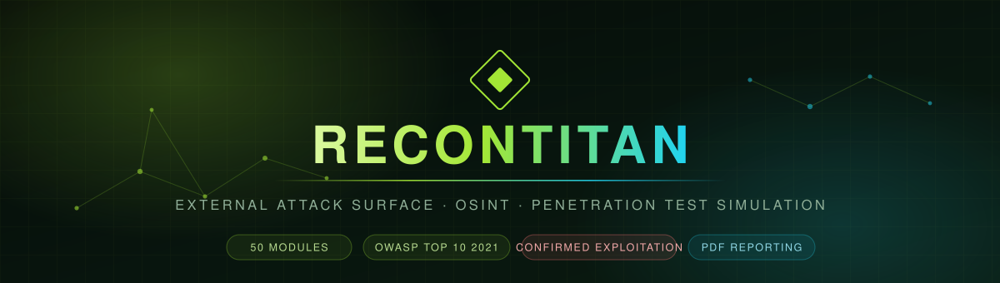

<br>

**A security-hardened platform for external reconnaissance, OSINT, web analysis, and bounded penetration-test simulation — with confirmed exploitation and professional PDF reporting.**

<br>

[](https://www.python.org/)
[](https://fastapi.tiangolo.com/)
[](https://docs.celeryq.dev/)
[](https://www.mongodb.com/)
[](https://docs.docker.com/compose/)

[](#-testing)
[](#-scan-profiles)
[](#-owasp-top-10-coverage)
[](CHANGELOG.md)
[](LICENSE)

<br>

[**Quick Start**](#-quick-start) · [**Features**](#-features) · [**Screenshots**](#-screenshots) · [**Danger Mode**](#-danger-mode) · [**API**](#-api-reference) · [**Docs**](docs/DANGER_MODE.md)

</div>

---

> [!WARNING]
> **Authorized testing only.** ReconTitan sends real traffic to the targets you give it. Scan only systems you own or hold **explicit written permission** to assess. Unauthorized scanning is unlawful in most jurisdictions. You — the operator — are responsible for every scan you start. See [SECURITY.md](SECURITY.md).

---

## Table of contents

<table>
<tr>
<td valign="top" width="33%">

**Getting started**
- [What it is](#-what-it-is)
- [Quick start](#-quick-start)
- [Installation](#-installation)
- [First scan](#-your-first-scan)

</td>
<td valign="top" width="33%">

**Using it**
- [Scan profiles](#-scan-profiles)
- [Features](#-features)
- [Screenshots](#-screenshots)
- [Danger Mode](#-danger-mode)
- [Reports](#-reports)

</td>
<td valign="top" width="33%">

**Reference**
- [API reference](#-api-reference)
- [Architecture](#-architecture)
- [Configuration](#-configuration)
- [Testing](#-testing)
- [Troubleshooting](#-troubleshooting)

</td>
</tr>
</table>

---

## ◈ What it is

ReconTitan takes **one target** and returns a complete, evidence-backed picture of its external attack surface — then, if you explicitly opt in, it goes further and *proves* which weaknesses are real.

<table>
<tr><td width="50%" valign="top">

### It maps
Domains, DNS records, certificates, historical URLs, subdomains, live hosts, open ports, technologies, JavaScript assets, and every input point an attacker could reach.

</td><td width="50%" valign="top">

### It assesses
Security headers, TLS configuration, CORS policy, cookie flags, WAF presence, subdomain takeover risk, CVE candidates, and threat-intelligence reputation.

</td></tr>
<tr><td width="50%" valign="top">

### It proves
Boolean-differential SQL injection, shell-arithmetic command injection, template evaluation, and reflection-context XSS — each with a **captured proof value**, not a guess.

</td><td width="50%" valign="top">

### It reports
An interactive masonry dashboard, a severity-ranked PDF with an OWASP coverage matrix, and **full code-level remediation** for every single finding.

</td></tr>
</table>

### Why it is different

| Most scanners | ReconTitan |
|---|---|
| Flag a *possible* SQL injection | Runs a boolean differential, then reads back the **database version banner** as proof |
| Report "reflected input" as XSS | Analyses the **reflection context** and reports whether breakout characters actually survived |
| Say "use parameterized queries" | Ships the **vulnerable and fixed code** in Python, PHP, Node, Java, C#, and Go — plus a `VERIFY` step |
| Dump found data into the report | **Quantifies** exposure (record counts, field names, PII classes) and fingerprints the values instead |
| Run intrusive tools by default | Fails closed: intrusive testing is **double-gated** and off unless you deliberately enable it |

---

## ⚡ Quick start

The fastest path — no Docker, no database, no Redis:

```bash
git clone https://github.com/D3v4nshPat3l/ReconTitan.git
cd ReconTitan
python -m venv .venv && .venv\Scripts\activate
pip install -r backend/requirements.txt
python -m uvicorn app.main:app --app-dir backend --port 8000
```

Open **<http://127.0.0.1:8000>**, type `example.com`, pick a profile, and hit **START SCAN**.

> The synchronous `/api/test-scan` path needs neither MongoDB nor Celery. Add them only when you want queued scans and stored history.

---

## ⬗ Installation

<details open>
<summary><b>Windows — step by step</b></summary>

<br>

**1. Install Python 3.11 or newer**

Download from [python.org](https://www.python.org/downloads/). On the first installer screen, tick **"Add python.exe to PATH"**. Verify:

```bash
python --version
```

**2. Get the code**

```bash
git clone https://github.com/D3v4nshPat3l/ReconTitan.git
cd ReconTitan
```

Or download the ZIP from GitHub and extract it, then `cd` into the folder.

**3. Create a virtual environment**

```bash
python -m venv .venv
```

Activation differs by shell. Pick the one you are actually using — the wrong one fails with `command not found`.

**PowerShell or Command Prompt:**

```bash
.venv\Scripts\activate
```

**Git Bash / MINGW64:**

```bash
source .venv/Scripts/activate
```

Git Bash is a POSIX shell, so it needs forward slashes and `source`. Using the PowerShell form there collapses the backslashes and produces `bash: .venvScriptsactivate: command not found`. Note it is still `.venv/Scripts/` on Windows even in Git Bash — not `.venv/bin/`, which is the Linux and macOS layout.

Your prompt should now start with `(.venv)`. Confirm the right interpreter is active:

```bash
python -c "import sys; print(sys.prefix)"
```

If PowerShell blocks the activation script, run PowerShell as Administrator once:

```bash
Set-ExecutionPolicy -Scope CurrentUser RemoteSigned
```

**4. Install dependencies**

```bash
python -m pip install --upgrade pip
```

```bash
pip install -r backend/requirements.txt
```

**5. Create your environment file**

`.env` is gitignored, so a fresh clone never contains one and every setting falls back to its built-in default — including `ALLOW_DANGER_MODE=false`. That is why Danger Mode is rejected on a new clone until you do this step.

**PowerShell or Command Prompt:**

```bash
copy .env.example .env
```

**Git Bash / MINGW64, Linux, macOS:**

```bash
cp .env.example .env
```

Verify it landed and check the setting:

```bash
grep ALLOW_DANGER_MODE .env
```

**6. Start it**

```bash
python -m uvicorn app.main:app --app-dir backend --port 8000
```

Then open <http://127.0.0.1:8000>.

</details>

<details>
<summary><b>Linux / macOS</b></summary>

<br>

```bash
git clone https://github.com/D3v4nshPat3l/ReconTitan.git
cd ReconTitan
python3 -m venv .venv && source .venv/bin/activate
pip install -r backend/requirements.txt
cp .env.example .env
python -m uvicorn app.main:app --app-dir backend --port 8000
```

</details>

<details>
<summary><b>Vercel — reduced serverless deployment</b></summary>

<br>

Vercel runs no long-lived processes and no system packages, so this is a
working but **reduced** configuration: 25 of 30 modules run (including every
Danger Mode stage), while `port_scan`, `subfinder`, `amass`, `waf_detect` and
`theharvester` are skipped, background scans are refused, and the admin console
loses its loopback isolation.

It needs MongoDB Atlas and Upstash Redis, both free tier. Redis is mandatory
rather than optional: rate limits and admin lockout otherwise live in each
instance's memory, so the ceilings multiply by instance count and lockout can
be sidestepped — silently, with nothing logged.

Full walkthrough: **[docs/VERCEL_DEPLOYMENT.md](docs/VERCEL_DEPLOYMENT.md)**

</details>

<details>
<summary><b>Docker Compose — full stack with workers, queue, and database</b></summary>

<br>

This brings up Nginx, the API, a Celery worker, Redis, and MongoDB.

**1. Create and fill `.env`**

```bash
cp .env.example .env
```

Generate strong secrets:

```bash
python -c "import secrets; print('SECRET_KEY=' + secrets.token_urlsafe(48)); print('API_ACCESS_KEY=' + secrets.token_urlsafe(48))"
```

Set at minimum: `DOMAIN`, `SECRET_KEY`, `API_ACCESS_KEY`, `CORS_ORIGINS`, `REDIS_PASSWORD`, `MONGO_ROOT_USER`, `MONGO_ROOT_PASS`, `MONGO_USER`, `MONGO_PASS`.

**2. Provide TLS certificates**

Place `fullchain.pem` and `privkey.pem` in `nginx/certs/`, or use Let's Encrypt via the mounted `/etc/letsencrypt`.

**3. Launch**

```bash
docker compose up -d --build
```

```bash
docker compose ps
```

**4. Check health**

```bash
curl -k https://localhost/api/health
```

Every container runs non-root, read-only, with `no-new-privileges` and all capabilities dropped.

</details>

<details>
<summary><b>Optional external tools</b></summary>

<br>

ReconTitan works fully without these; each one fails soft and is skipped when absent.

| Tool | Adds | Install |
|---|---|---|
| `nmap` | Deeper port and service detection | [nmap.org](https://nmap.org/download.html) |
| `subfinder` | Extra passive subdomain sources | `go install github.com/projectdiscovery/subfinder/v2/cmd/subfinder@latest` |
| `amass` | Extra passive enumeration | [OWASP Amass](https://github.com/owasp-amass/amass) |
| `nuclei` | Template-based checks (**opt-in**) | `go install github.com/projectdiscovery/nuclei/v3/cmd/nuclei@latest` |

The last group only runs with `ENABLE_ACTIVE_VULN_TOOLS=true`.

</details>

---

## ▶ Your first scan

<table>
<tr><td width="55%" valign="top">

**In the browser**

1. Open <http://127.0.0.1:8000>
2. Enter a target you are authorized to scan
3. Choose a profile card
4. Press **START SCAN**
5. Watch live module telemetry
6. The interactive report opens automatically
7. Export **PDF**, **JSON**, or **HTML**

</td><td width="45%" valign="top">

**From the command line**

```bash
curl "http://127.0.0.1:8000/api/test-scan?target=example.com&scan_type=full"
```

```bash
curl "http://127.0.0.1:8000/api/capabilities"
```

</td></tr>
</table>

---

## ◆ Scan profiles

<div align="center">
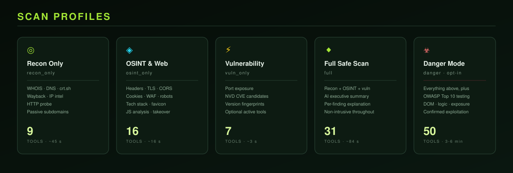
</div>

| Profile | Key | Modules | Covers | Real run vs `example.com` |
|---|---|:---:|---|---|
| **Recon Only** | `recon_only` | 9 | WHOIS, DNS, crt.sh, Wayback, IP intel, HTTP probe, passive subdomains | 45 s · 9 findings |
| **OSINT & Web** | `osint_only` | 16 | Headers, TLS, CORS, cookies, WAF, robots, tech stack, favicon, JS analysis, takeover, threat intel | 16 s · 17 findings |
| **Vulnerability** | `vuln_only` | 7 | Port exposure, NVD CVE candidates, version fingerprints | 3 s · 11 findings |
| **Full Safe Scan** | `full` | 30 | Everything above plus AI summary | 84 s · 35 findings |
| **Danger Mode** ☣ | `danger` | 50 | Everything above **plus** OWASP Top 10 testing, DOM analysis, business logic, data exposure, and confirmed exploitation | 253 s · 56 findings · 20 stages · 130 requests |

> Every figure above is from an actual scan on a home connection, not an estimate. `GET /api/capabilities` returns this metadata as JSON for integrations.

---

## ✦ Features

<details open>
<summary><b>Reconnaissance & OSINT</b></summary>

<br>

| Module | What it does |
|---|---|
| **WHOIS** | Registrar, dates, nameservers, expiry warnings, privacy detection |
| **DNS** | A, AAAA, MX, TXT, NS, SOA, CNAME, SRV plus SPF and DMARC posture |
| **crt.sh** | Certificate-transparency subdomain discovery with sensitive-name flagging |
| **Wayback** | Historical URLs and interesting archived paths |
| **IP intelligence** | Geolocation, ASN, organization, reverse-IP neighbours |
| **HTTP probe** | Status, title, server, redirect chain, technology hints |
| **Subfinder / Amass** | Additional passive enumeration when installed |
| **Subdomain takeover** | Conservative CNAME + provider fingerprint + NXDOMAIN correlation |

</details>

<details open>
<summary><b>Web & client-side analysis</b></summary>

<br>

| Module | What it does |
|---|---|
| **Security headers** | HSTS, CSP, X-Frame-Options, nosniff, Referrer-Policy, Permissions-Policy |
| **TLS/SSL** | Certificate chain, expiry, protocol, cipher, obsolete-version acceptance |
| **CORS** | Origin reflection, wildcard, credential exposure |
| **Cookies** | HttpOnly, Secure, SameSite on every issued cookie |
| **WAF detection** | Fingerprints common WAF and CDN products |
| **Technology stack** | 27 signatures across headers, HTML, cookies, and asset paths |
| **JavaScript analysis** | Bounded same-scope inspection for redacted secrets, risky sinks, source maps, endpoints |
| **Favicon hash** | MD5, SHA-256, and Shodan-compatible MurmurHash3 for asset correlation |

</details>

<details open>
<summary><b>Vulnerability & intelligence</b></summary>

<br>

| Module | What it does |
|---|---|
| **Port exposure** | Common-port discovery with dangerous-service flagging |
| **NVD CVE lookup** | Technology-led keyword search, labelled as candidates |
| **Version fingerprints** | Matches detected versions against known end-of-life and vulnerable releases |
| **Threat intelligence** | VirusTotal, Shodan, GreyNoise, Censys (all optional, all fail soft) |
| **AI analysis** | Executive summary, risk level, prioritized recommendations, per-finding explanation |

</details>

<details>
<summary><b>Security controls built into the platform itself</b></summary>

<br>

ReconTitan is a security tool, so it is also built like one:

- **27-category injection screening** on every request — SQLi, XSS, SSTI, command injection, SSRF, XXE, NoSQL, LDAP, XPath, traversal, Log4Shell, prototype pollution, and more
- **Multi-layer URL decoding** to catch double and triple-encoded bypasses
- **SSRF protection**: targets are normalized, resolved, and pinned; redirects are revalidated; private, loopback, and link-local ranges are rejected by default
- **DNS-rebinding resistance** — the resolved address is pinned for the connection
- **Layered rate limiting** — burst, scan, danger, API, and export buckets with temporary bans
- **Request-framing checks** for duplicate `Content-Length` and conflicting `Transfer-Encoding`
- **Security headers** on every response, including early exits
- **Bounded downloads** with per-module byte ceilings
- **Non-root, read-only containers** with all capabilities dropped
- **Production fail-closed startup** — refuses to boot with default secrets or wildcard CORS
- **No inline scripts or event handlers** in the frontend; strict CSP

</details>

---

## ▣ Screenshots

<div align="center">

### Scan console

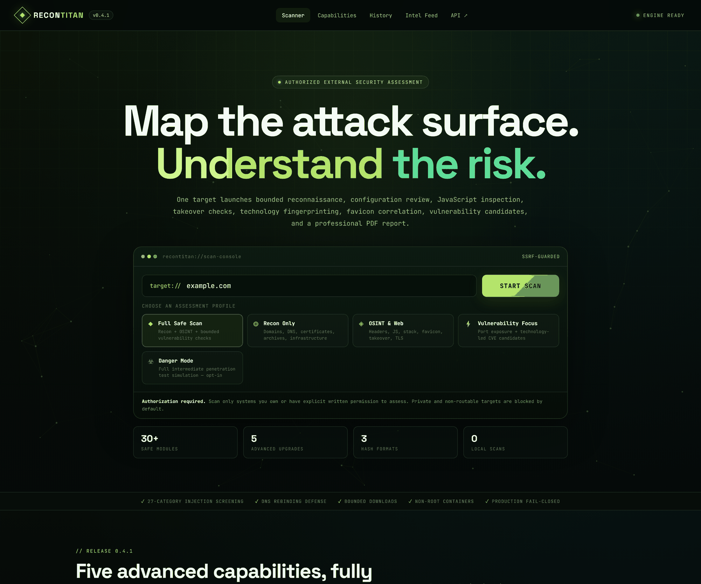

<sub>Five assessment profiles, live target validation, and an SSRF-guarded scan console.</sub>

<br><br>

### Danger Mode — the two-lock gate

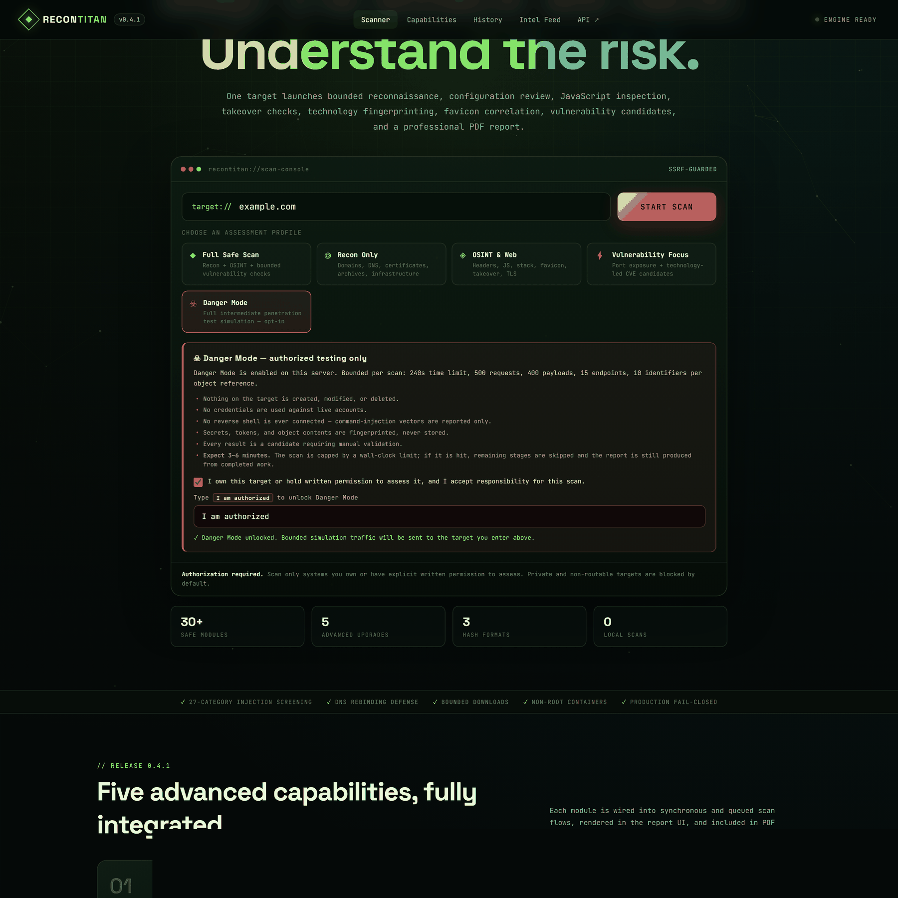

<sub>Selecting Danger Mode reveals a warning card. The scan button stays disabled until you tick the authorization box <b>and</b> type the exact phrase. The gate is never restored from storage — it must be re-acknowledged every session.</sub>

<br><br>

### Interactive report — Full Safe Scan

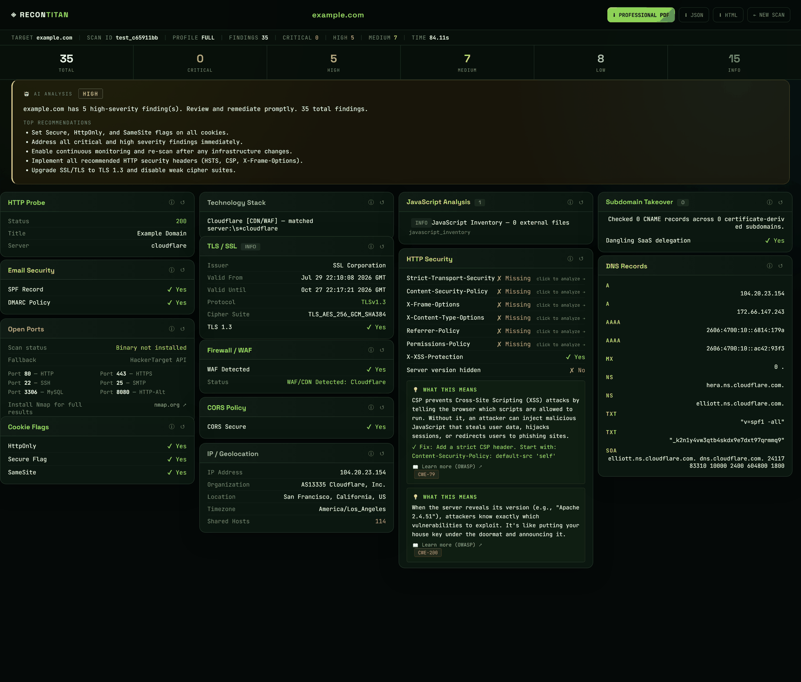

<sub>A masonry report of `example.com`: severity summary, AI analysis, and one card per module. Every card is clickable for full evidence and remediation.</sub>

<br><br>

### Interactive report — Danger Mode

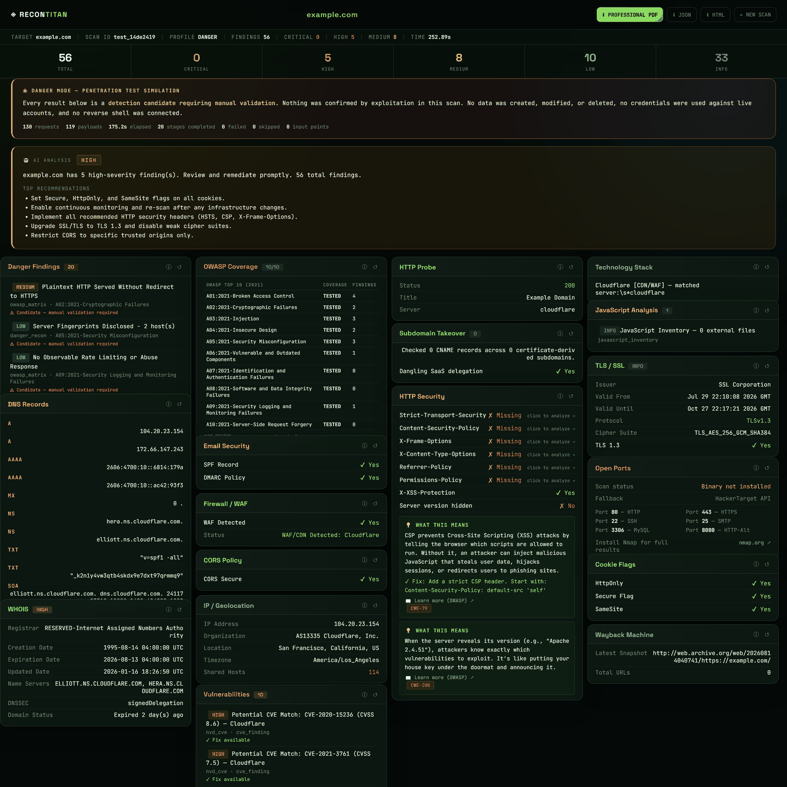

<sub>A real Danger Mode scan of <code>example.com</code>: 56 findings, 20 stages, 130 bounded requests in 175s. The banner reports exactly what was confirmed and what was not, and the OWASP matrix shows 10/10 categories exercised.</sub>

<br><br>

### OWASP coverage and danger findings

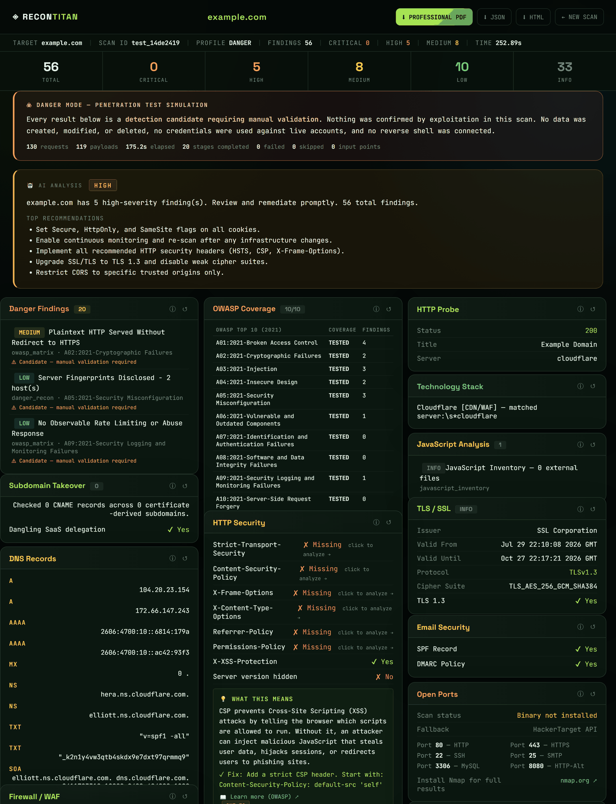

<sub>Every OWASP Top 10 category is reported as TESTED or NOT TESTED with its finding count — coverage you can audit rather than assume.</sub>

<br><br>

### Finding detail — evidence, proof, and the full fix

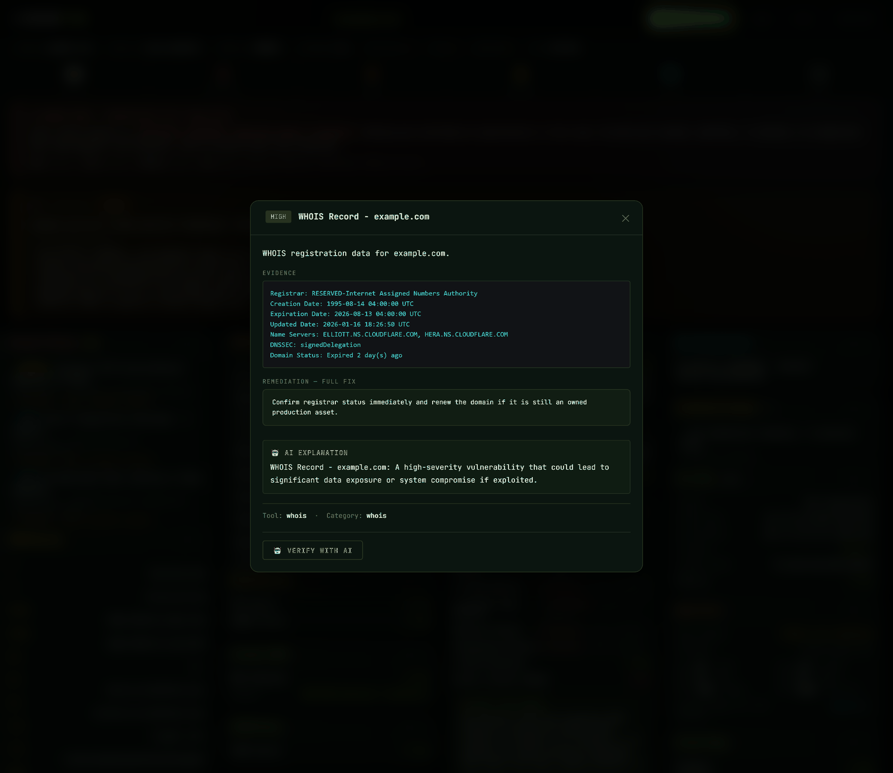

<sub>Each finding opens with its evidence, the exploitation proof where one was captured, and complete code-level remediation ending in a <code>VERIFY</code> step.</sub>

<br><br>

### Focused profiles

<table>
<tr>
<td width="33%">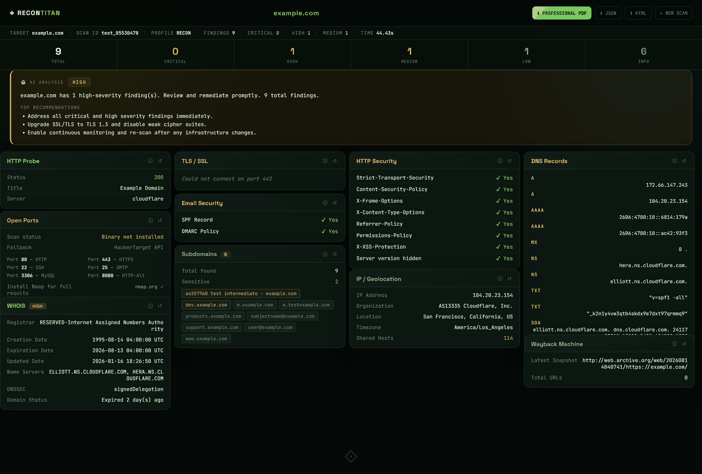<br><sub align="center"><b>Recon Only</b></sub></td>
<td width="33%">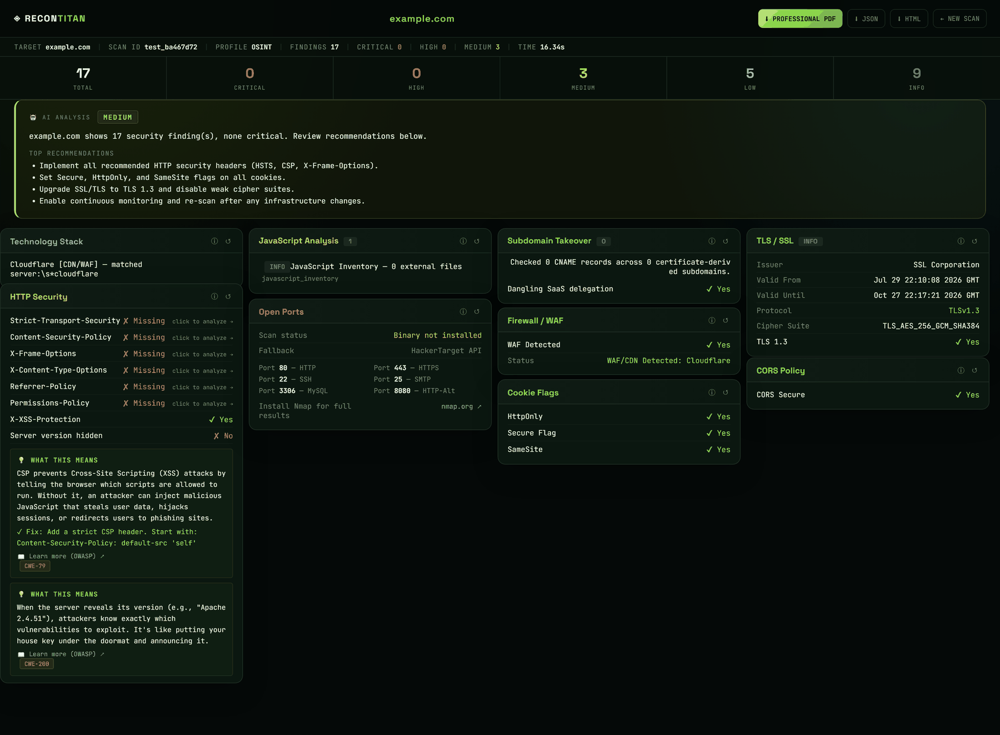<br><sub><b>OSINT &amp; Web</b></sub></td>
<td width="33%">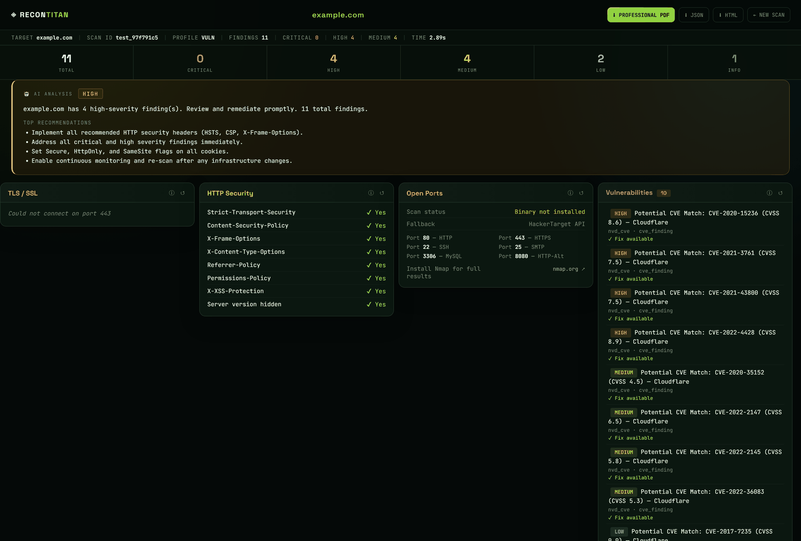<br><sub><b>Vulnerability Focus</b></sub></td>
</tr>
</table>

<br>

### PDF export

<table>
<tr>
<td width="50%">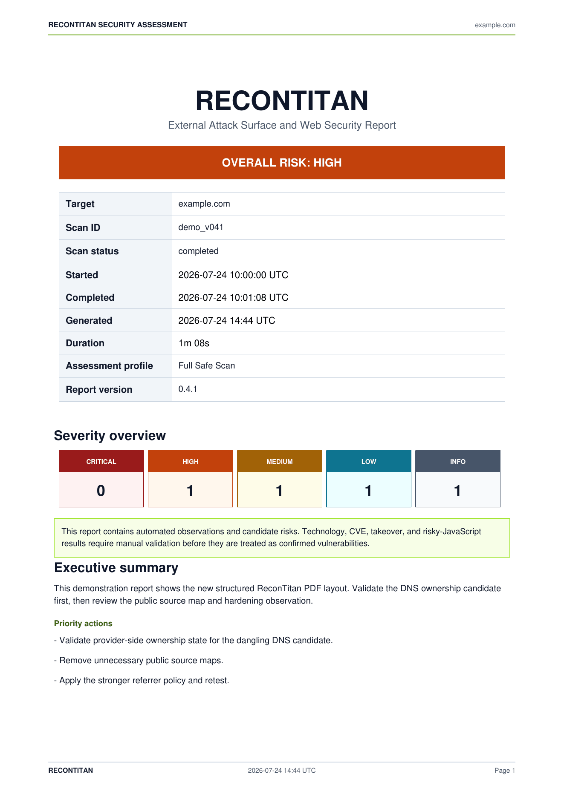</td>
<td width="50%">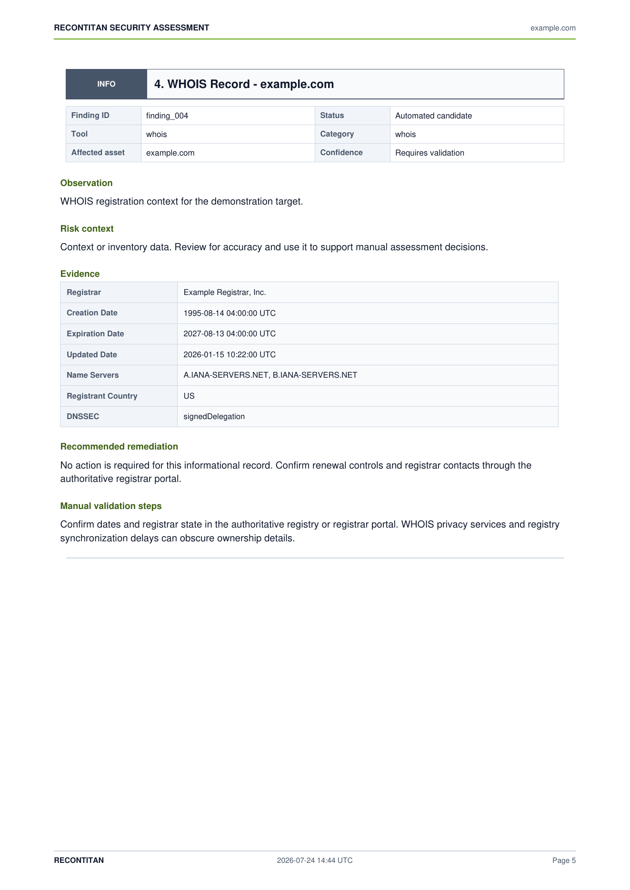</td>
</tr>
</table>

<sub>Portable, severity-ranked PDF with risk banner, methodology, module coverage, colour-coded findings index, structured evidence, and remediation.</sub>

</div>

---

## ☣ Danger Mode

> [!CAUTION]
> Danger Mode sends **active attack-simulation traffic**. It is disabled by default and requires two independent unlocks. Use it only against systems you own or hold written permission to assess.

<div align="center">
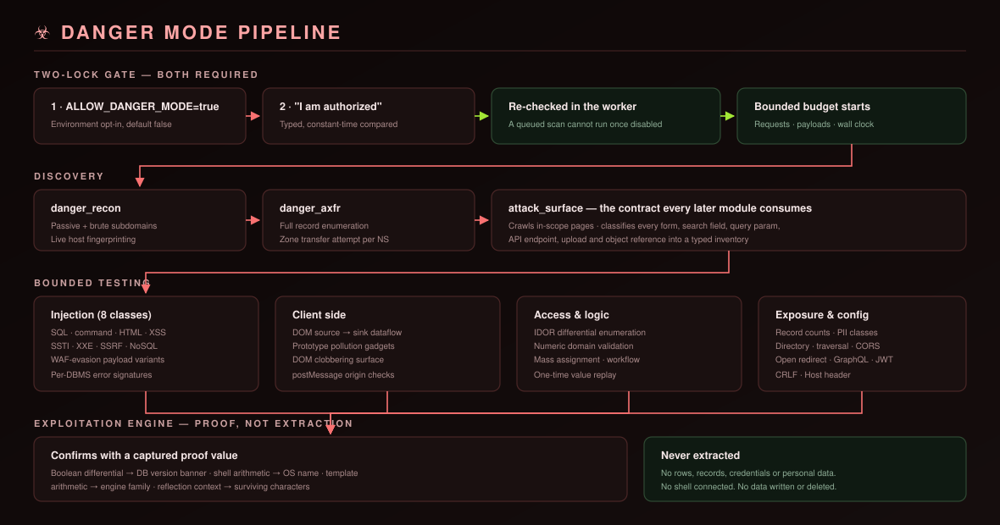
</div>

### The two-lock gate

Both are required, and both are re-checked inside the worker so a queued scan cannot run after you disable the profile:

```bash
# Lock 1 — environment opt-in (default: false)
ALLOW_DANGER_MODE=true
```

```bash
# Lock 2 — typed acknowledgement, compared in constant time
danger_acknowledgement=I am authorized
```

Without both, the API returns **403** with an explanatory message.

### What it adds

| Stage | Purpose |
|---|---|
| `danger_recon` | Passive + bounded brute-force subdomain sweep, live-host fingerprinting |
| `danger_axfr` | Full record enumeration and AXFR zone-transfer attempt against every name server |
| `attack_surface` | Crawls in-scope pages, classifies every form, search field, parameter, API endpoint, upload, and object reference |
| `injection_*` | SQL, command, HTML, XSS, SSTI, XXE, SSRF, NoSQL — with WAF-evasion payload variants |
| `reverse_shell_assessment` | Documents the vector and confirming evidence — **detection only, never a payload** |
| `dom_injection` | Source-to-sink dataflow, prototype pollution, DOM clobbering, postMessage origin checks |
| `directory_fuzzing` / `path_traversal` | Bounded wordlist fuzzing with soft-404 filtering, plus 12 traversal encodings |
| `idor_testing` | Sequential, base64, and UUID identifier enumeration with baseline-differential analysis |
| `business_logic` | Numeric-domain validation, mass assignment, workflow bypass, one-time-value replay |
| `data_exposure` | Record counts, field names, PII and credential classes, unbounded pagination |
| `advanced_checks` | CORS exploitation, open redirect, GraphQL introspection, JWT weaknesses, CRLF, Host header |
| `owasp_matrix` | Remaining OWASP categories and the tested / not-tested coverage matrix |

### Confirmed exploitation

Danger Mode does not stop at detection. When a parameter shows a signal — or, for **blind** injection, even when it does not — the exploitation engine attempts to *prove* the issue:

| Class | How it is proven | Proof captured |
|---|---|---|
| **SQL injection** | Boolean differential across two requests, or arithmetic in a numeric context | Database version banner |
| **Command injection** | The shell computes an arithmetic expression | Computed product, then the OS name |
| **SSTI** | The engine evaluates arithmetic while the literal disappears | Computed product and engine family |
| **XSS** | Reflection-context analysis | Context plus the surviving character set |
| **Path traversal** | Response matches a system-file signature | Signature name and byte count |
| **CORS / open redirect** | The server echoes an arbitrary origin, or issues the redirect | The response header itself |

Confirmed findings are titled `[EXPLOITED]`, promoted in severity, and carry `exploited`, `exploit_technique`, `exploit_proof`, and `exploit_impact`.

**Proof is deliberately minimal.** The engine extracts a version banner, an arithmetic result, a platform name, or a reflection context — **never rows, records, credentials, or personal data**.

### Guards against false positives

A scanner that cries wolf is worse than one that stays quiet, so confirmation is conservative:

- **Value sensitivity** — arithmetic only counts if the endpoint's output actually varies with the parameter
- **Silent defaults** — an app that falls back to a default when `int()` raises is rejected, because it mimics arithmetic evaluation
- **Reflection is not XSS** — encoded breakout characters mean low severity and *not* exploited
- **Template literals** — SSTI requires the product present **and** the literal absent
- **One-hop DOM flows** are candidates, not confirmations

### Safety bounds — enforced in code

| Guarantee | How |
|---|---|
| No data created, modified, or deleted | Read-only canaries; logic checks observe validation without completing a transaction |
| No data exfiltration | Exposure is *quantified* (counts, field names, classes); values are fingerprinted and discarded |
| No credential stuffing | One fixed non-credential value; no list, no account targeted |
| No reverse shell | Vectors documented; no connecting payload is generated or sent |
| No third-party contact | SSRF probes use private canaries the scanner never fetches |
| Bounded traffic | Ceilings on requests, payloads, endpoints, crawl depth, and identifiers |
| Bounded time | Wall-clock deadline; pacing and timeouts clamp to remaining budget |
| Always terminates | Pending stages are skipped and recorded — **a report is always produced** |
| Fail-soft | A failing stage is recorded; remaining stages still run |

Full documentation: **[docs/DANGER_MODE.md](docs/DANGER_MODE.md)** · Authorization requirements: **[SECURITY.md](SECURITY.md)**

---

## ◫ OWASP Top 10 coverage

| Category | Covered by |
|---|---|
| **A01** Broken Access Control | IDOR differential enumeration, forced browsing, method-variation checks |
| **A02** Cryptographic Failures | TLS protocol/cipher review, plaintext-HTTP detection, secret fingerprinting |
| **A03** Injection | SQL, command, HTML, XSS, SSTI, XXE, NoSQL, DOM injection |
| **A04** Insecure Design | Login rate limiting, password-reset exposure, unvalidated upload, business logic |
| **A05** Security Misconfiguration | Debug endpoints, directory listing, verbose errors, headers, AXFR |
| **A06** Vulnerable Components | NVD candidates plus known-vulnerable version fingerprints |
| **A07** Auth Failures | CSRF tokens, password policy, session cookie flags, lockout behaviour |
| **A08** Integrity Failures | Missing subresource integrity, deserialization indicators |
| **A09** Logging & Monitoring | Missing headers plus absence of observable rate limiting |
| **A10** SSRF | Private-canary probing on URL-accepting parameters |

> **TESTED means a module ran — not that the application is clean. NOT TESTED means unassessed.** Categories needing authenticated state, business knowledge, or source access require a manual engagement.

---

## ▤ Reports

<table>
<tr><td width="50%" valign="top">

### Interactive
- Masonry card layout, one card per module
- Severity summary bar and metadata strip
- Click any finding for evidence, proof, and fix
- AI risk banner with prioritized actions
- Danger Mode banner, OWASP matrix, attack-surface and injection tables
- Export **JSON** or standalone **HTML**

</td><td width="50%" valign="top">

### PDF
- Branded cover with overall risk banner
- Scan metadata, timeline, and severity cards
- Methodology and module-coverage table
- Colour-coded findings index
- Per-finding evidence, exploitation proof, and remediation
- Danger Mode section with OWASP matrix
- Appendices: severity model and limitations

</td></tr>
</table>

### Remediation quality

Every finding ships a complete fix, not a platitude — root cause, the vulnerable pattern, the corrected pattern in the languages teams actually use, configuration changes, defence-in-depth, and a **VERIFY** section:

```text
ROOT CAUSE
User input is concatenated into a SQL statement, so the database parses attacker
text as code rather than treating it as a value.

THE FIX - parameterize every query. Never build SQL with string operations.

Python (psycopg / sqlite3 / MySQLdb):
    # VULNERABLE
    cur.execute("SELECT * FROM orders WHERE id = " + user_id)
    # FIXED
    cur.execute("SELECT * FROM orders WHERE id = %s", (user_id,))
...
VERIFY
Re-run the boolean-differential probe from the evidence. The TRUE and FALSE
conditions must now return byte-identical responses.
```

**29 remediation entries, ~1,100 lines** covering Python, PHP, Node.js, Java, C#, Go, nginx, Apache, and BIND.

---

## ⬢ API reference

Protected routes accept either header:

```http
X-ReconTitan-Key: your-access-key
```

```http
Authorization: Bearer your-access-key
```

| Method | Endpoint | Auth | Purpose |
|---|---|---|---|
| `GET` | `/api/health` | Public | Health check |
| `GET` | `/api/capabilities` | Public | Profiles, modules, Danger Mode metadata |
| `GET` | `/api/news` | Public | Cached cybersecurity feed |
| `GET` | `/api/test-scan` | Protected | Synchronous scan — no MongoDB or Celery needed |
| `POST` | `/api/scan` | Protected | Queue a scan in Celery |
| `GET` | `/api/scan/{id}/status` | Protected | Poll progress and module state |
| `GET` | `/api/scan/{id}/report` | Protected | Normalized JSON report |
| `GET` | `/api/scan/{id}/report.pdf` | Protected | Export a stored scan as PDF |
| `POST` | `/api/report/pdf` | Protected | Render supplied scan data as PDF |
| `POST` | `/api/verify` | Protected | AI-assisted finding verification |

<details>
<summary><b>Examples</b></summary>

<br>

**Synchronous scan**

```bash
curl "http://127.0.0.1:8000/api/test-scan?target=example.com&scan_type=osint_only"
```

**Danger Mode — both locks required**

```bash
curl "http://127.0.0.1:8000/api/test-scan?target=example.com&scan_type=danger&danger_acknowledgement=I%20am%20authorized"
```

**Queue a scan**

```bash
curl -X POST http://127.0.0.1:8000/api/scan -H "Content-Type: application/json" -d '{"target":"example.com","scan_type":"full"}'
```

**Check whether Danger Mode is enabled**

```bash
curl -s http://127.0.0.1:8000/api/capabilities | python -c "import json,sys; print(json.load(sys.stdin)['danger_mode']['enabled'])"
```

</details>

---

## ⬡ Architecture

<div align="center">
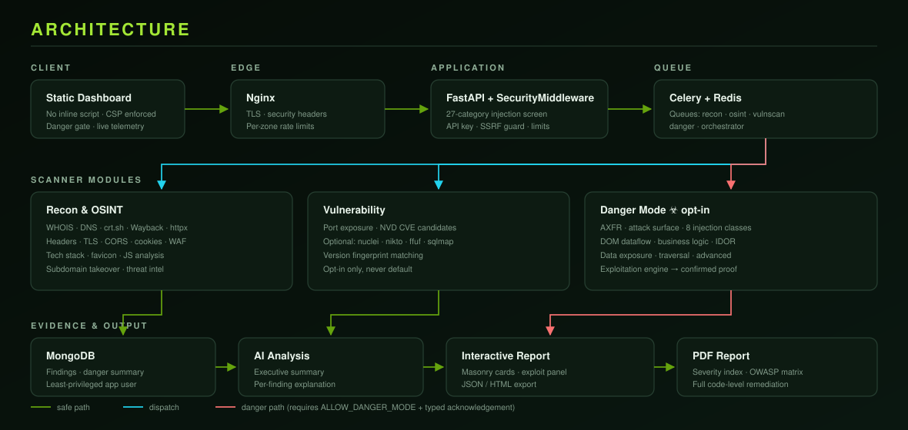
</div>

<details>
<summary><b>Project structure</b></summary>

<br>

```text
ReconTitan/
├── backend/
│   ├── app/
│   │   ├── main.py                 # FastAPI entry point, middleware stack
│   │   ├── config.py               # Environment configuration + production validation
│   │   ├── targeting.py            # Target normalization, SSRF and rebinding defense
│   │   ├── celery_app.py           # Queue configuration and routing
│   │   ├── middleware/security.py  # 27-category injection screen, rate limits, headers
│   │   ├── models/schemas.py       # Pydantic v2 request/response models
│   │   ├── routers/                # capabilities · scans · reports · news · test_scan
│   │   ├── services/
│   │   │   ├── capabilities.py     # Canonical profile and module metadata
│   │   │   ├── danger_mode.py      # Opt-in gate, bounds, OWASP catalogue
│   │   │   └── pdf_report.py       # PDF renderer
│   │   └── tasks/
│   │       ├── http_client.py      # Pinned, bounded, redirect-revalidating client
│   │       ├── scan_tasks.py       # Celery orchestration
│   │       ├── recon/              # WHOIS, DNS, crt.sh, wayback, tech, JS, takeover…
│   │       ├── osint/              # headers, TLS, CORS, cookies, WAF, threat intel
│   │       └── vulnscan/
│   │           ├── nvd_lookup.py
│   │           └── danger/         # ☣ 18 modules, ~7,400 lines
│   │               ├── pipeline.py         # Stage coordinator + deadline guard
│   │               ├── budget.py           # Request/payload/time ceilings, pacing
│   │               ├── payloads.py         # WAF-evasion payload library
│   │               ├── exploit.py          # Confirmation engine
│   │               ├── remediation.py      # Code-level fixes
│   │               ├── attack_surface.py   # Input-point inventory
│   │               ├── injection.py        # 8 injection classes
│   │               ├── dom.py              # Source-to-sink dataflow
│   │               ├── business_logic.py   # Logic flaw probes
│   │               ├── data_exposure.py    # Exposure quantification
│   │               ├── advanced.py         # CORS, redirect, GraphQL, JWT, CRLF
│   │               ├── idor.py · directory.py · dns_axfr.py
│   │               ├── owasp.py · recon.py · reverse_shell.py
│   └── tests/                      # 121 tests across 11 files
├── frontend/                       # Static dashboard and report (no build step)
├── docs/                           # Danger Mode docs, diagrams, screenshots
├── nginx/nginx.conf                # TLS, headers, per-zone rate limits
├── docker-compose.yml              # Nginx · API · worker · Redis · MongoDB
└── .env.example                    # Every setting, documented
```

</details>

**Request flow:** browser → Nginx (TLS, headers, rate limits) → FastAPI (`SecurityMiddleware`) → target validation and DNS pinning → Celery dispatch or synchronous run → scanner modules → normalization → MongoDB → AI summary → interactive report and PDF.

---

## ⚙ Configuration

<details open>
<summary><b>Required in production</b></summary>

<br>

| Variable | Purpose |
|---|---|
| `DOMAIN` | Public hostname for Nginx and trusted-host validation |
| `SECRET_KEY` | Application secret, ≥32 random characters |
| `API_ACCESS_KEY` | Shared API access key, ≥32 random characters |
| `CORS_ORIGINS` | Explicit comma-separated origins — never `*` |
| `MONGO_ROOT_PASS` / `MONGO_PASS` | Administrative and least-privileged app passwords |
| `REDIS_PASSWORD` | Broker password |

The app **refuses to start** in production with default secrets, wildcard CORS, or a missing API key.

</details>

<details>
<summary><b>Scanner safety and limits</b></summary>

<br>

| Variable | Default | Meaning |
|---|---:|---|
| `ALLOW_PRIVATE_TARGETS` | `false` | Allow RFC1918/private targets — never enable publicly |
| `ENABLE_ACTIVE_VULN_TOOLS` | `false` | Enable nuclei, nikto, dir fuzzing, sqlmap |
| `MAX_REQUEST_BODY_BYTES` | `2097152` | Global API body cap |
| `JS_ANALYSIS_MAX_FILES` | `20` | Same-scope JavaScript files |
| `JS_ANALYSIS_MAX_BYTES` | `1048576` | Per-script byte cap |
| `TAKEOVER_MAX_SUBDOMAINS` | `150` | Subdomains checked for takeover |
| `RATE_LIMIT_BURST` | `30` | Short-window burst allowance |
| `RATE_LIMIT_SCAN` | `5` | Scan starts per minute |
| `RATE_LIMIT_DANGER` | `2` | Danger scans per minute, stacked on the above |
| `RATE_LIMIT_API` | `120` | General API requests per minute |
| `RATE_LIMIT_EXPORT` | `10` | PDF exports per minute |

</details>

<details>
<summary><b>Danger Mode limits</b></summary>

<br>

Every value is a hard ceiling, never a target.

| Variable | Default | Meaning |
|---|---:|---|
| `ALLOW_DANGER_MODE` | `false` | Master opt-in — 403 while false |
| `DANGER_MAX_SCAN_SECONDS` | `240` | Wall-clock ceiling; pending stages are skipped and reported |
| `DANGER_MAX_REQUESTS_TOTAL` | `500` | Requests for the whole danger phase |
| `DANGER_MAX_REQUESTS_PER_MODULE` | `80` | Requests any single module may send |
| `DANGER_MAX_PAYLOADS_PER_SCAN` | `400` | Payload-bearing probes |
| `DANGER_MAX_ENDPOINTS` | `15` | Attack-surface entries tested |
| `DANGER_MAX_CRAWL_PAGES` | `10` | Pages fetched building the inventory |
| `DANGER_MAX_HOSTS` | `5` | Discovered hosts probed |
| `DANGER_REQUEST_DELAY_MS` | `150` | Pacing between probes |
| `DANGER_TIME_DELAY_SECONDS` | `2` | Delay for the single time-based blind probe |
| `DANGER_SUBDOMAIN_BRUTE_LIMIT` | `100` | Names from the built-in wordlist |
| `DANGER_DIR_BUST_WORDLIST` | `120` | Paths from the built-in wordlist |
| `DANGER_IDOR_MAX_IDS` | `10` | Identifiers enumerated per object reference |
| `DANGER_ENABLE_XXE_OOB` | `false` | Out-of-band XXE — off and intentionally unimplemented |

Seeing **"budget exhausted"** or **"time limit reached"** in a report means coverage was partial. Raise the relevant ceiling, or narrow the target.

</details>

<details>
<summary><b>Optional integrations</b></summary>

<br>

`OPENAI_API_KEY`, `VIRUSTOTAL_API_KEY`, `SHODAN_API_KEY`, `CENSYS_API_ID`, `CENSYS_API_SECRET`, `GREYNOISE_API_KEY`, `SECURITYTRAILS_API_KEY`, `URLSCAN_API_KEY`, `INTELX_API_KEY`.

Each is optional and fails soft. Some submit the target to a third party — review their privacy and retention policy before enabling.

</details>

---

## ✓ Testing

```bash
pip install -r backend/requirements-dev.txt
```

```bash
pytest -q backend/tests
```

```text
121 passed
```

| Suite | Covers |
|---|---|
| `test_api_security.py` | Headers, injection blocking, rate limits, API-key gate, content-type enforcement |
| `test_targeting.py` | Normalization, SSRF rejection, DNS rebinding |
| `test_http_client.py` | Pinning, redirect revalidation, byte caps |
| `test_danger_mode.py` | Opt-in gate, discovery, classification, budget, deadline, secret hygiene |
| `test_danger_integration.py` | End-to-end against a local fixture server |
| `test_danger_exploit_integration.py` | **Exploitation proof** against a deliberately vulnerable fixture |
| `test_features.py` | Tech stack, favicon, JS analysis, takeover, WHOIS |
| `test_pdf.py` | PDF rendering, danger section, escaping |
| `test_capabilities.py` · `test_config.py` · `test_frontend_security.py` | Metadata, config validation, frontend CSP rules |

**No test contacts an external host.** The integration suites start a local fixture server on `127.0.0.1`.

Additional checks:

```bash
python -m compileall -q backend/app
```

```bash
node --check frontend/dashboard.js && node --check frontend/report.js
```

---

## ⚑ Troubleshooting

<details>
<summary><b>Danger Mode is disabled / the scan is rejected with 403</b></summary>

<br>

Both locks are required. Set `ALLOW_DANGER_MODE=true` in `.env`, restart, and supply the typed acknowledgement. Verify the server sees it:

```bash
curl -s http://127.0.0.1:8000/api/capabilities | python -c "import json,sys; print(json.load(sys.stdin)['danger_mode'])"
```

</details>

<details>
<summary><b>The UI does not reflect my changes</b></summary>

<br>

Static assets are versioned with a `?v=` token. If you edit `dashboard.js`, `report.js`, or their stylesheets, bump the token in `index.html` and `report.html` — otherwise browsers keep serving the cached copy.

</details>

<details>
<summary><b>"budget exhausted" or "time limit reached" in the report</b></summary>

<br>

The scan hit a safety ceiling and stopped early, so coverage is partial — it does **not** mean the untested areas are clean. Raise `DANGER_MAX_REQUESTS_TOTAL` / `DANGER_MAX_SCAN_SECONDS`, or scan a narrower target.

</details>

<details>
<summary><b>Scans fail or return nothing</b></summary>

<br>

- Private, loopback, and reserved targets are rejected by design
- The target must resolve publicly
- `/api/scan` requires MongoDB; use `/api/test-scan` for a local run
- Check the server log — modules fail soft and record the reason

</details>

<details>
<summary><b>A takeover, CVE, or exploitation result appears</b></summary>

<br>

Reproduce it manually before acting. CVE matches are keyword candidates; takeover requires provider-side confirmation; exploitation proof should be re-run from an authorized system to rule out caching, load balancing, and dynamic content.

</details>

---

## ⚖ Limitations

ReconTitan is not proof that a target is secure or vulnerable.

External observations can be incomplete, stale, blocked, rate-limited, or intentionally deceptive. Danger Mode is a bounded **simulation**: a confirmed finding is a strong lead, an absent finding is not a clean bill of health, and a `NOT TESTED` OWASP category is unassessed rather than clean. AI output can be wrong and must be checked against evidence. The built-in rate limiter is process-local — enforce shared limits at the edge when scaling horizontally. The access-key model is a shared secret, not a multi-user identity system.

---

## ⚭ Contributing

Read [CONTRIBUTING.md](CONTRIBUTING.md), branch from `main`, run the tests, avoid committing secrets or scan data, and open a pull request with validation evidence.

```bash
pytest -q backend/tests && python -m compileall -q backend/app
```

---

## ⚖ License

Released under the [MIT License](LICENSE).

---

<div align="center">

**Built for authorized security testing.**

[Danger Mode docs](docs/DANGER_MODE.md) · [Security policy](SECURITY.md) · [Changelog](CHANGELOG.md) · [OWASP Top 10](https://owasp.org/www-project-top-ten/)

<sub>ReconTitan © 2026 · Scan only what you are authorized to scan.</sub>

</div>
