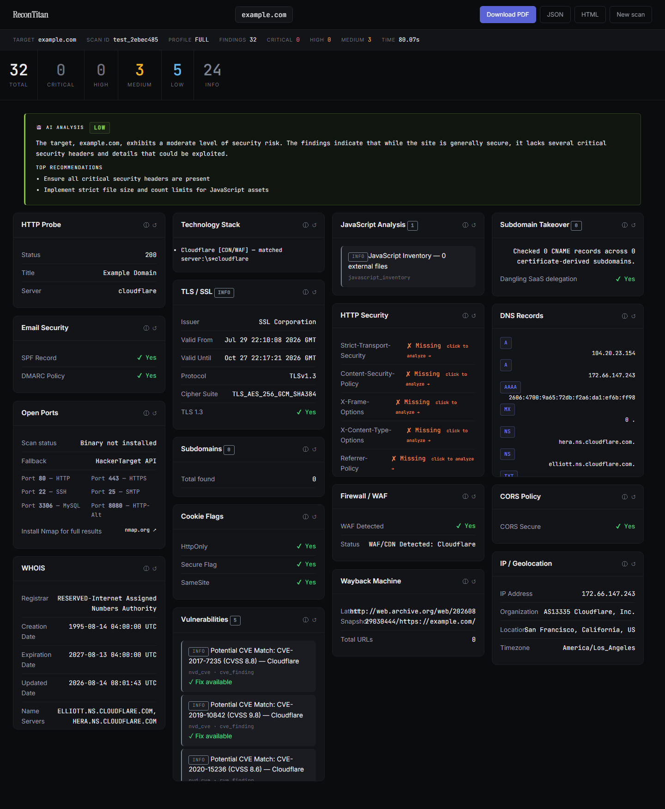

<div align="center">


<br><br>

# ReconTitan

**Point it at a domain. Get back everything that domain shows the internet — enumerated, checked against known weaknesses, and written up with the evidence behind every claim.**

[](https://www.python.org/)
[](https://fastapi.tiangolo.com/)
[](https://docs.celeryq.dev/)
[](https://www.mongodb.com/)
[](https://docs.docker.com/compose/)

[](#testing)
[](#what-it-actually-runs)
[](#owasp-top-10-coverage)
[](CHANGELOG.md)
[](LICENSE)

</div>

---

## Table of contents

- [What this is](#what-this-is)
- [See it working](#see-it-working)
- [How it works](#how-it-works)
- [Scan profiles — and how long each really takes](#scan-profiles--and-how-long-each-really-takes)
- [What it actually runs](#what-it-actually-runs)
- [Quick start — 5 minutes, no Docker](#quick-start--5-minutes-no-docker)
- [Full setup with Docker Compose](#full-setup-with-docker-compose)
- [Configuration](#configuration)
- [Danger Mode](#danger-mode)
- [The SOC console](#the-soc-console)
- [Troubleshooting](#troubleshooting)
- [Testing](#testing)
- [Legal and ethical use](#legal-and-ethical-use)
- [License](#license)

---

## What this is

Most "security scanners" hand you a wall of raw tool output and leave the interpretation to you. ReconTitan is built the other way round: **every finding carries the evidence that produced it**, and the report is designed to be read by a person, not grepped.

Give it a domain and it will:

1. **Map the attack surface** — WHOIS, DNS records, certificate transparency logs, archived URLs, subdomains, live hosts, open ports, IP and hosting attribution.
2. **Analyse what it found** — TLS configuration, security headers, cookie flags, CORS policy, technology fingerprints, JavaScript inventory, WAF/CDN detection, subdomain-takeover exposure.
3. **Match against known weaknesses** — CVE candidates from the NVD, OWASP Top 10 categorisation, misconfiguration checks.
4. **Optionally simulate an attacker** — Danger Mode sends bounded, paced, explicitly-authorised probes: injection families, path traversal, IDOR, business-logic, data-exposure and DOM analysis.
5. **Write it up** — an interactive report, a plain-English summary, and an exportable PDF/JSON/HTML.

Everything is **candidate-graded**. The tool never claims a confirmed exploit; it tells you what it saw and what would confirm it. That distinction is enforced in the code, not just the wording.

---

## See it working

### The report — a real `full` scan of `example.com`

This is not a mockup. It is the actual report from `example.com`: **25 modules, 32 findings, 80 seconds.**

<div align="center">

</div>

Every card is a module. The severity band at the top is computed, not decorative. The AI summary at the top is written from the findings themselves — it cannot invent counts, because the numbers are injected rather than generated.

Notice what an honest scanner looks like: **Open Ports** says `Binary not installed` and names its fallback. **Subdomains** reports `0` rather than padding the number. **Wayback** shows what it actually retrieved. A tool that never says "I couldn't check this" is a tool you cannot trust.

### The SOC console

A separate, hardened application that shows who is using your deployment — every scan, every source address, every blocked attack, in IST.

<div align="center">

</div>

Threat events, injections blocked, auth failures, rate-limited requests, failed console logins, hostile-vs-normal traffic by hour, and a ranked list of the noisiest sources with their attack classes.

<div align="center">

</div>

The console is a **separate ASGI application** from the public API. The public app has no admin routes at all, so no public-routing bug can expose it. It binds to loopback and expects to be reached over an SSH tunnel.

---

## How it works

```
                 ┌──────────────────────────────────────────────┐
   Browser ─────▶│  FastAPI  (app.main)                         │
                 │  ├─ SecurityMiddleware   rate limit,         │
                 │  │                       injection guard,    │
                 │  │                       header hygiene      │
                 │  ├─ TrustedHost          host-header checks  │
                 │  ├─ CORS                 explicit origins    │
                 │  └─ StaticFiles          serves the frontend │
                 └───────────────┬──────────────────────────────┘
                                 │
              ┌──────────────────┴───────────────────┐
              │                                      │
   ┌──────────▼───────────┐            ┌─────────────▼──────────────┐
   │ GET /api/test-scan   │            │ POST /api/scan             │
   │ synchronous          │            │ queued via Celery          │
   │ no Celery, no Mongo  │            │ needs Redis + a worker     │
   │ ← the browser uses   │            │ ← for long/batch jobs      │
   │   this one           │            │                            │
   └──────────┬───────────┘            └─────────────┬──────────────┘
              │                                      │
              └──────────────┬───────────────────────┘
                             ▼
              ┌──────────────────────────────┐
              │  Scan pipeline               │
              │  recon → osint → vuln        │
              │  → danger (if authorised)    │
              └──────────────┬───────────────┘
                             ▼
        ┌────────────────────┴─────────────────────┐
        ▼                    ▼                     ▼
   MongoDB              Redis                 AI provider
   scan history         rate limits           Ollama / OpenAI / none
   audit trail          shared state          summaries + explanations
   (optional)           (optional)            (optional)
```

**The parts that matter technically:**

**Every outbound request goes through one client.** `app.tasks.http_client.safe_request` enforces SSRF protection, response-size ceilings, timeouts and redirect limits. Modules never call `requests` directly. That is why pointing a scan at `localhost` is refused — the guard sees it before a packet leaves.

**Danger Mode traffic is budgeted, not just rate-limited.** `DangerBudget` enforces two independent ceilings — a request/payload count *and* a wall-clock deadline — and paces every probe, backing off automatically when the target returns 429 or 503. A single probe's timeout is clamped to the remaining budget, so one dead endpoint cannot overrun the whole scan.

**Findings never carry response bodies.** Danger Mode stores a SHA-256 fingerprint of a response instead of its content, so an analyst can tell two responses apart without the tool ever retaining secrets, session material or personal data it stumbled across.

**Storage is fail-soft on purpose.** If MongoDB is unreachable, scans still run and still report; you lose history and the console, not the tool. The trade-off is that silent degradation needs a deliberate check, which is what `python -m app.preflight` is for.

**Three optional dependencies, three graceful degradations.** No MongoDB → no history. No Redis → rate limits become per-process. No AI provider → summaries fall back to a deterministic template. None of the three stops a scan.

---

## Scan profiles — and how long each really takes

These are **measured numbers** from cold runs against `example.com` on a home connection, not estimates. The spread is real: certificate-transparency logs and the Wayback Machine are third-party services whose response times vary a lot from one run to the next.

| Profile | Modules | Typical time | What you get |
|---|---|---|---|
| **Recon Only** | 8 | **20–55 s** | WHOIS, DNS, certificate transparency, archived URLs, live-host probing, IP attribution, subdomain enumeration |
| **OSINT & Web** | 15 | **10–25 s** | TLS, security headers, cookies, CORS, tech stack, JS inventory, WAF/CDN, takeover exposure, threat-intel lookups |
| **Vulnerability** | 2 | **5–15 s** | Port exposure and NVD CVE candidate matching |
| **Full Scan** | 25 | **60–120 s** | Everything above, in one report |
| **Danger Mode** | 25 + 20 stages | **3–6 minutes** | Everything above **plus** bounded active penetration-test simulation |

### Read this before you get impatient

**Full Scan and Danger Mode take time, and that is the tool working correctly, not hanging.**

A Full Scan makes real network requests to certificate-transparency logs, the Wayback Machine, DNS resolvers, the NVD, and the target itself. Several of those are public services that are sometimes slow. The scanner waits, because a 15-second wait that returns archived URLs is worth more than an instant result that returns nothing.

Danger Mode is slower still, deliberately. It **paces** its traffic — there is a configurable delay between probes and an automatic backoff when the target signals throttling. A danger scan that finished in 20 seconds would be a scan that hammered the target, and that is exactly the behaviour that gets a scanner blocked or a tester in trouble.

**What you get for the wait is the whole point:** 32 findings on a domain as minimal as `example.com`, each with its own evidence block, severity, OWASP category and remediation. On a real application the difference between profiles is dramatic.

**Watch the live log while it runs.** Every stage announces itself with a timestamp, so you can always see what it is doing:

```
[15:42:31] → WHOIS and DNS reconnaissance
[15:42:39] → Certificate Transparency discovery
[15:42:53] → Wayback history
[15:42:54] → Infrastructure and HTTP probing
[15:42:55] → Technology stack detection
```

If a stage takes 15 seconds, it is waiting on someone else's server. Let it finish.

---

## What it actually runs

<details>
<summary><b>Recon — 8 modules</b></summary>

`whois` · `dns_lookup` (A, AAAA, MX, NS, TXT, CNAME, SOA, plus SPF/DMARC analysis, all queried concurrently) · `crt.sh` certificate transparency · `wayback` archived URLs · `ipinfo` geolocation and ASN · `httpx_probe` live-host detection · `subfinder` · `amass`

</details>

<details>
<summary><b>OSINT & Web — 15 modules</b></summary>

`tech_stack` · `favicon_hash` correlation · `js_analysis` · `subdomain_takeover` · `security_headers` · `ssl_check` (issuer, validity, protocol, cipher suite) · `robots_sitemap` · `cors_check` · `cookie_check` · `waf_detect` · `virustotal` · `shodan` · `greynoise` · `censys` · `theharvester`

Threat-intel modules skip silently when no API key is configured — they cost nothing and are simply absent from the report.

</details>

<details>
<summary><b>Vulnerability — 2 modules (plus 4 optional)</b></summary>

`port_scan` (nmap when installed, HackerTarget API as fallback) · `nvd_cve` version-matched CVE candidates

With `ENABLE_ACTIVE_VULN_TOOLS=true` and the binaries present: `nuclei` · `nikto` · `dir_fuzzing` · `sqlmap`

</details>

<details>
<summary><b>Danger Mode — 20 stages</b></summary>

`danger_recon` · `danger_axfr` zone-transfer attempts · `attack_surface` · seven injection families (`sqli`, `command`, `html`, `xss`, `ssti`, `xxe`, `ssrf`, `nosql`) · `reverse_shell_assessment` · `dom_injection` · `directory_fuzzing` · `path_traversal` · `idor_testing` · `business_logic` · `data_exposure` · `advanced_checks` · `owasp_matrix`

</details>

### OWASP Top 10 coverage

| Category | Covered by |
|---|---|
| A01 Broken Access Control | IDOR testing, path traversal, business logic |
| A02 Cryptographic Failures | TLS analysis, cookie flags, cryptographic checks |
| A03 Injection | Seven injection families, DOM analysis |
| A04 Insecure Design | Business-logic probes, rate-limit observation |
| A05 Security Misconfiguration | Headers, CORS, directory exposure, misconfiguration checks |
| A06 Vulnerable Components | Tech-stack fingerprinting into NVD CVE matching |
| A07 Auth Failures | Credential-handling assessment, session-flag checks |
| A08 Integrity Failures | JavaScript inventory, subresource analysis |
| A09 Logging Failures | Logging/monitoring inference from response behaviour |
| A10 SSRF | Dedicated SSRF probe family |

---

## Quick start — 5 minutes, no Docker

**This is the fastest path and it needs nothing but Python.** MongoDB, Redis and Docker are all optional — the browser calls a synchronous scan endpoint that runs without any of them. You get full scanning immediately; you just don't get saved history or the SOC console until you add MongoDB.

### Step 1 — Get the code

```bash
git clone https://github.com/D3v4nshPat3l/ReconTitan.git
cd ReconTitan
```

### Step 2 — Create a virtual environment

**A virtual environment is not optional here.** Anaconda and some system Pythons ship a patched `pyOpenSSL` that breaks the `cryptography` library this project uses. A clean venv avoids an hour of confusing errors. (See [Troubleshooting](#troubleshooting) if you have already hit it.)

<details open>
<summary><b>Linux / macOS</b></summary>

```bash
python3 -m venv .venv
source .venv/bin/activate
```

</details>

<details>
<summary><b>Windows — PowerShell</b></summary>

```powershell
python -m venv .venv
.\.venv\Scripts\Activate.ps1
```

If PowerShell refuses with *"running scripts is disabled on this system"*, allow it for this window only:

```powershell
Set-ExecutionPolicy -Scope Process -ExecutionPolicy Bypass
```

</details>

<details>
<summary><b>Windows — Git Bash</b></summary>

```bash
python -m venv .venv
source .venv/Scripts/activate
```

</details>

You will know it worked when your prompt shows `(.venv)`.

### Step 3 — Install dependencies

```bash
pip install -r backend/requirements.txt
```

Around 16 packages, roughly 30 seconds.

### Step 4 — Create your configuration

<details open>
<summary><b>Linux / macOS / Git Bash</b></summary>

```bash
cp .env.example .env
```

</details>

<details>
<summary><b>Windows — PowerShell</b></summary>

```powershell
Copy-Item .env.example .env
```

</details>

The defaults are set for local development and work as-is. Danger Mode is already enabled in `.env.example`.

### Step 5 — Run it

```bash
cd backend
python -m uvicorn app.main:app --reload --port 8000
```

Open **<http://127.0.0.1:8000>**, enter a domain you own, choose a profile, and scan.

### Step 6 — Confirm it works from the command line

```bash
curl "http://127.0.0.1:8000/api/health"
```

Expected: `{"status":"healthy","app":"ReconTitan","version":"0.5.0"}`

Run a real scan without touching the browser:

```bash
curl "http://127.0.0.1:8000/api/test-scan?target=example.com&scan_type=recon_only"
```

---

## Full setup with Docker Compose

Use this when you want **saved scan history, the SOC console, Celery workers, and no wall-clock limit on Danger Mode.** This is the deployment the project was designed around.

### Prerequisites

- Docker Engine 24+ and the Compose plugin (`docker compose version`)
- 2 GB RAM free

### Step 1 — Generate real secrets

Never reuse the placeholders. Generate four distinct values:

```bash
python -c "import secrets; [print(secrets.token_urlsafe(48)) for _ in range(4)]"
```

### Step 2 — Fill in `.env`

Compose refuses to start if any of these are missing — that is deliberate, so you cannot accidentally deploy with blanks:

```ini
DOMAIN=localhost
CORS_ORIGINS=http://localhost:8000
SECRET_KEY=<first generated value>
API_ACCESS_KEY=<second generated value>
MONGO_USER=recontitan
MONGO_PASS=<third generated value>
REDIS_PASSWORD=<fourth generated value>
ADMIN_ENABLED=true
ADMIN_TOKEN=<generate a fifth value>
ALLOW_DANGER_MODE=true
```

> **Leave no variable blank.** A variable that *exists with an empty value* is not the same as one that is absent — the empty string wins over the default. The code now treats blank as unset for every setting, but an empty value in your `.env` is still a mistake waiting to confuse you.

### Step 3 — Start the stack

```bash
docker compose up -d
```

Brings up nginx, Redis, MongoDB, the API, a Celery worker, and the admin console.

### Step 4 — Check everything came up

```bash
docker compose ps
```

```bash
docker compose logs -f api
```

### Step 5 — Pre-flight your configuration

```bash
docker compose exec api python -m app.preflight
```

This audits secrets, storage reachability, client-IP attribution, admin exposure and scanning behaviour, and **exits non-zero if anything is genuinely unsafe**. It reports the failures that would otherwise be silent — a missing NVD key making rate-limited 403s look like "no CVEs found", or a missing Redis making a limit of 5 quietly become 5 × instance count.

### Step 6 — Open the SOC console

The console is not routed publicly. Reach it over an SSH tunnel:

```bash
ssh -N -L 9000:127.0.0.1:9000 user@your-server
```

Then open <http://127.0.0.1:9000> and paste your `ADMIN_TOKEN`.

Running locally without Docker? Start it directly:

```bash
python run_admin.py
```

---

## Configuration

Everything is environment variables; `.env.example` is the annotated reference. The settings you are most likely to touch:

### Core

| Variable | Default | What it does |
|---|---|---|
| `RECONTITAN_DEBUG` | `true` | `false` in production — disables `/api/docs` and strips error detail |
| `DOMAIN` | `localhost` | Hostname for host-header validation. No scheme, no trailing slash |
| `CORS_ORIGINS` | `http://localhost:8000` | Browser origins — **with** scheme |
| `SECRET_KEY` | *(empty)* | 32+ random characters. Required in production |
| `API_ACCESS_KEY` | *(empty)* | Set this and every `/api/` route needs an `X-ReconTitan-Key` header |

> **`DOMAIN` and `CORS_ORIGINS` look inconsistent on purpose.** `DOMAIN` is a hostname used for Host-header matching. `CORS_ORIGINS` is a browser origin and must carry `https://`. It is not a typo.

### Multi-user API keys

Instead of one shared secret, issue named keys so the audit trail records *who* ran each scan and you can revoke one without cutting off everyone:

```ini
API_ACCESS_KEYS=alice:<key>,bob:<key>,ci:<key>
```

### Scan behaviour

| Variable | Default | What it does |
|---|---|---|
| `ALLOW_DANGER_MODE` | `true` | Master switch for active testing |
| `DANGER_MAX_SCAN_SECONDS` | `240` | Wall-clock ceiling for the danger phase |
| `DANGER_MAX_REQUESTS_TOTAL` | `500` | Hard request ceiling for a whole danger scan |
| `DANGER_REQUEST_DELAY_MS` | `150` | Pacing between probes |
| `SCAN_TOOL_CONCURRENCY` | `8` | Modules run in parallel |
| `ALLOW_PRIVATE_TARGETS` | `false` | Allow RFC1918 targets. Only for testing against your own lab |
| `ENABLE_ACTIVE_VULN_TOOLS` | `false` | Enables nuclei/nikto/dir-fuzzing/sqlmap when installed |

### AI explanations

| Variable | Default | What it does |
|---|---|---|
| `AI_PROVIDER` | `auto` | `auto`, `ollama`, `openai`, or `none` |
| `OLLAMA_BASE_URL` | `http://localhost:11434` | Local model endpoint |
| `OLLAMA_MODEL` | *(empty)* | e.g. `qwen2.5:7b` |

With `auto`, ReconTitan probes for a local Ollama instance and falls back to a deterministic template if there isn't one. **Findings never leave your machine** unless you explicitly choose `openai`. Full guide: [`docs/OLLAMA_SETUP.md`](docs/OLLAMA_SETUP.md).

---

## Danger Mode

Danger Mode sends **real attack traffic**. It is not a simulation in the sense of "pretend" — the probes are genuine, they are simply bounded, paced and non-destructive.

### Getting in requires three deliberate acts

1. `ALLOW_DANGER_MODE=true` must be set by whoever runs the server.
2. The user must tick an ownership/authorisation checkbox.
3. The user must **type** the exact phrase:

   ```
   I am authorized
   ```

The typed phrase is required by the API itself, not just the UI — the gate cannot be bypassed by calling the endpoint directly.

### What keeps it safe

- **Bounded** — hard ceilings on total requests, requests per module, payloads per scan and endpoints touched.
- **Paced** — a configurable delay between probes, with automatic exponential backoff on 429/503.
- **Time-capped** — at the wall-clock limit, remaining stages are skipped and **the report is still produced**. You always get results, never an error page.
- **Non-destructive** — no data is modified or deleted. Payloads are detection probes, not exploits.
- **Evidence-only storage** — response bodies are fingerprinted, never retained.
- **Always candidate-graded** — `requires_manual_validation` is unconditionally true on every danger finding.

Full detail: [`docs/DANGER_MODE.md`](docs/DANGER_MODE.md).

---

## The SOC console

A separate application on its own port, with its own authentication:

- **Overview** — threat events, injections blocked, auth failures, rate-limited requests, failed console logins, unique sources
- **Detections** — behavioural patterns: port-discovery sweeps, payload injection, admin-console probing, DDoS-shaped traffic
- **Threats / Event Feed / Scan Activity / Clients / Targets** — attribution for every request and scan
- **Blocklist** — refuse to *scan* certain hosts, and refuse to *serve* certain callers (single IPs or CIDR ranges)

Security properties worth knowing:

- Not mounted on the public app at all — a routing bug cannot expose it
- Constant-time token comparison, with lockout after repeated failures
- Optional `ADMIN_IP_ALLOWLIST` (single addresses or CIDR)
- Supports token rotation via `ADMIN_TOKEN_PREVIOUS` so you can rotate without downtime
- All timestamps rendered in **IST**

---

## Troubleshooting

Real problems, with the actual fix. Most were hit during development.

<details open>
<summary><b>❗ <code>module 'lib' has no attribute 'GEN_EMAIL'</code> — the #1 setup killer</b></summary>

**Cause:** Anaconda (or another system Python) ships a patched `pyOpenSSL` that conflicts with the `cryptography` version this project needs.

**Fix:** use a clean virtual environment — do not `pip install` into a base Anaconda environment.

```bash
python -m venv .venv
```

If you are already inside a conda environment, `conda deactivate` first, then create the venv.

</details>

<details>
<summary><b><code>The token '&&' is not a valid statement separator</code> (Windows PowerShell)</b></summary>

**Cause:** Windows PowerShell 5.1 does not support `&&`.

**Fix:** use `;` or run the commands on separate lines.

```powershell
cd backend; python -m uvicorn app.main:app --port 8000
```

Or use Git Bash, where `&&` works normally.

</details>

<details>
<summary><b><code>Activate.ps1 cannot be loaded because running scripts is disabled</code></b></summary>

```powershell
Set-ExecutionPolicy -Scope Process -ExecutionPolicy Bypass
```

Applies to the current window only and reverts when you close it.

</details>

<details>
<summary><b><code>[Errno 48] Address already in use</code> / port 8000 busy</b></summary>

Run on another port:

```bash
python -m uvicorn app.main:app --reload --port 8080
```

Or find what is holding it — Linux/macOS: `lsof -i :8000` · Windows: `netstat -ano | findstr :8000`

</details>

<details>
<summary><b>Scans work, but the SOC console is empty and history never saves</b></summary>

**Cause:** MongoDB is not reachable. This is deliberately non-fatal — scanning continues, storage silently no-ops.

**Confirm it:**

```bash
python -m app.preflight
```

**Fix:** start MongoDB (`docker compose up -d mongo`), or set `MONGO_URI` to an Atlas connection string.

</details>

<details>
<summary><b><code>Open Ports: Binary not installed</code></b></summary>

Not an error. `nmap` is not on your PATH, so the scan fell back to the HackerTarget API and said so.

For full port results install nmap — Linux: `sudo apt install nmap` · macOS: `brew install nmap` · Windows: <https://nmap.org/download.html>

</details>

<details>
<summary><b>Danger Mode stays greyed out / <code>LOCKED</code></b></summary>

All three are required:

1. `ALLOW_DANGER_MODE=true` in `.env` — **restart the server after changing it**
2. The authorisation checkbox ticked
3. The phrase `I am authorized` typed exactly — lowercase `a`, no trailing space

</details>

<details>
<summary><b><code>Malicious input blocked</code> when scanning <code>localhost</code></b></summary>

Working as designed — the SSRF guard refuses private and loopback targets.

For a local lab, set `ALLOW_PRIVATE_TARGETS=true`. Only do this on a machine where you own everything on the local network.

</details>

<details>
<summary><b><code>[crt.sh] 502 Bad Gateway</code> or <code>[wayback] CDX query failed</code></b></summary>

Transient failures of public third-party services. The scan continues and reports what it could retrieve. Re-run later if you specifically need archived URLs.

</details>

<details>
<summary><b>A scan seems frozen for 15+ seconds</b></summary>

Almost certainly normal. Check the live log — if the last line is Wayback, certificate transparency or NVD, it is waiting on someone else's server. See [how long each profile really takes](#scan-profiles--and-how-long-each-really-takes).

</details>

<details>
<summary><b>Everything returns 401 <code>API access key required</code></b></summary>

`API_ACCESS_KEY` is set, so every `/api/` route needs the header. Either supply it:

```bash
curl -H "X-ReconTitan-Key: <your key>" "http://127.0.0.1:8000/api/test-scan?target=example.com"
```

…or unset `API_ACCESS_KEY` in `.env` for a local-only instance.

</details>

<details>
<summary><b><code>ValueError: invalid literal for int()</code> on startup</b></summary>

An environment variable exists but is **blank**. Current versions treat blank as unset, so this only affects older checkouts — but an empty value in `.env` is always a mistake. Delete the line rather than leaving it empty.

</details>

---

## Testing

```bash
cd backend
python -m pytest -q --ignore=app
```

```
551 passed, 11 skipped
```

`--ignore=app` skips a router file named `test_scan.py` that pytest would otherwise mis-collect as a test module — it is an application route, not a test.

The suite covers the security middleware, SSRF guards, the danger budget, scan targeting, deployment configuration, serverless behaviour, client-IP attribution and admin authentication.

---

## Legal and ethical use

**Only scan systems you own or have explicit written permission to test.**

Unauthorised scanning is illegal in most jurisdictions — the Computer Fraud and Abuse Act in the US, the Computer Misuse Act in the UK, and the Information Technology Act in India, among many others. Passive reconnaissance sits in a grey area. **Danger Mode does not** — it sends active attack traffic and is unambiguously covered by those laws.

Safe targets to learn on:

- Domains you own
- Deliberately vulnerable applications you run yourself — OWASP Juice Shop, DVWA, WebGoat
- Public bug-bounty programmes **whose scope explicitly permits automated scanning** — check the policy first, many forbid it

If you deploy this where others can reach it, remember that scan traffic originates from *your* infrastructure. You will receive the abuse report, whoever typed the domain.

---

## License

MIT — see [LICENSE](LICENSE).

Copyright © 2026 Devansh Patel

---

<div align="center">
<sub>Built by <a href="https://github.com/D3v4nshPat3l">Devansh Patel</a></sub>
</div>
