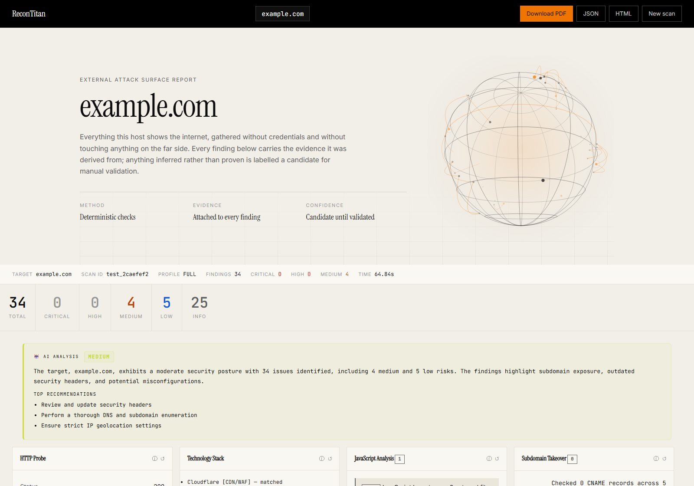
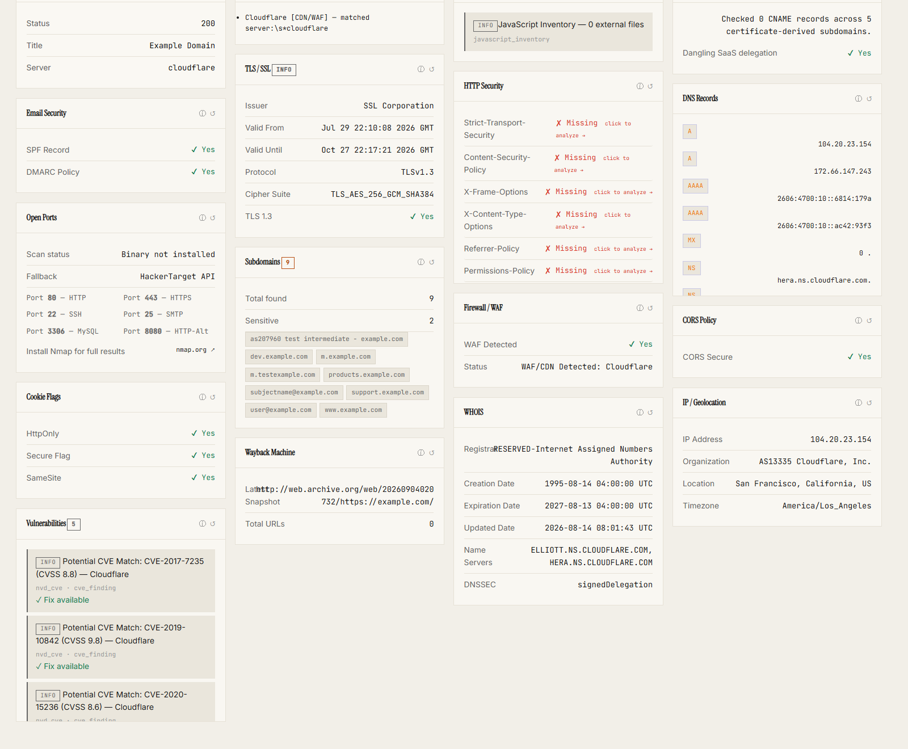
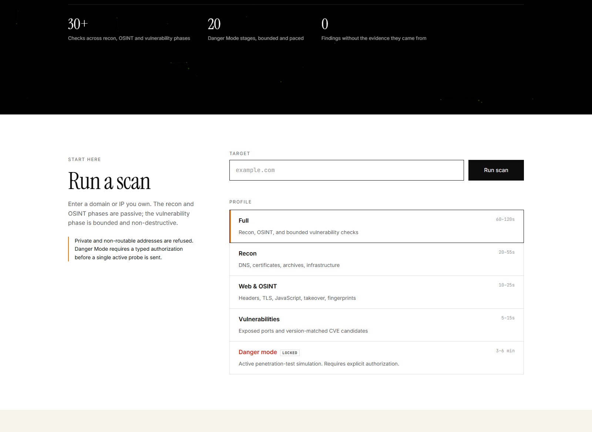
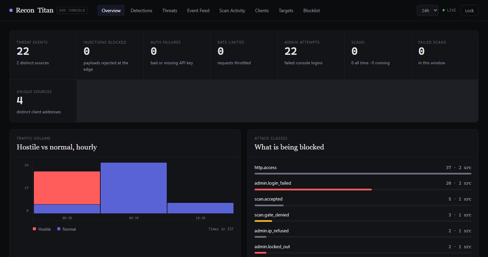
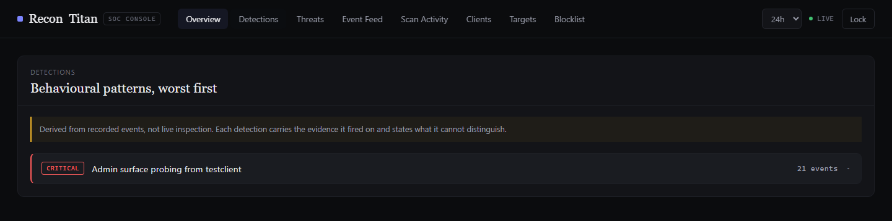
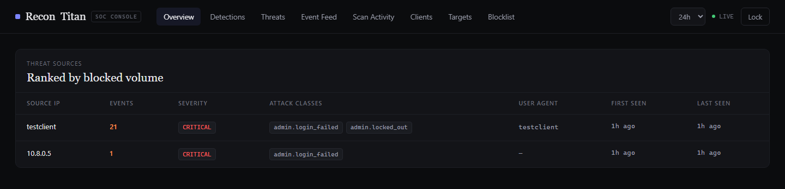
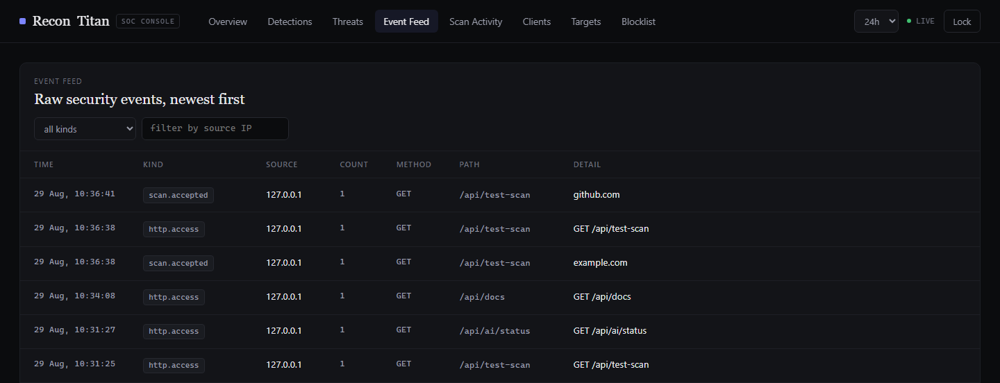
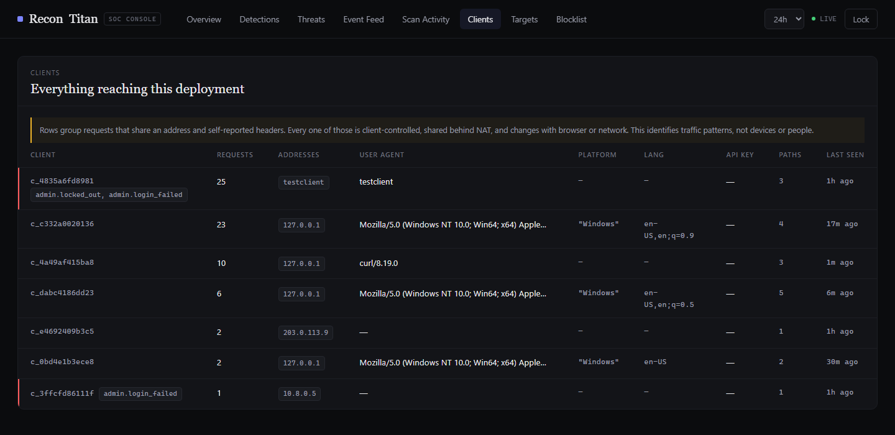
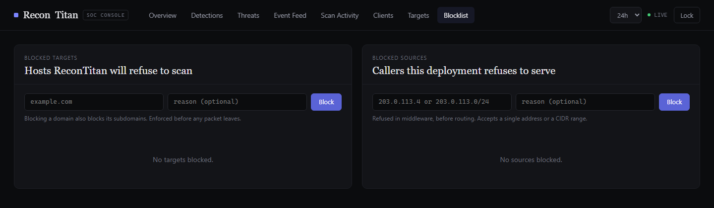
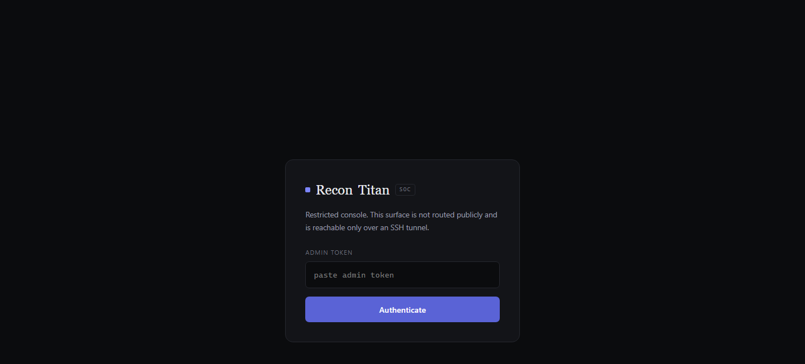

<div align="center">


<br><br>

# ReconTitan

**Point it at a domain. Get back everything that domain shows the internet — enumerated, checked against known weaknesses, and written up with the evidence behind every claim.**

[](https://www.python.org/)
[](https://fastapi.tiangolo.com/)
[](#testing)
[](#what-it-checks)
[](#owasp-coverage)
[](LICENSE)

</div>

---

## Get it running

**One command. It checks what you have, installs only what's missing, and tells you before it does anything.**

<table>
<tr>
<td width="50%" valign="top">

**Windows**

```
setup.bat
```

Double-click it, or run it from a terminal.

</td>
<td width="50%" valign="top">

**macOS / Linux**

```bash
bash setup.sh
```

Alternatively: `chmod +x setup.sh` followed by `./setup.sh`.

</td>
</tr>
</table>

The script prints its full plan before touching anything, then walks through six steps out loud: find Python, create a private environment inside this folder, install the packages into it, offer to install **nmap**, write a config file, start the scanner.

`setup.sh` is for macOS and Linux only. Run it under Git Bash on Windows and it stops and points you at `setup.bat` — Windows lays virtual environments out differently, and continuing would overwrite a working one.

It touches **three things**, all inside this directory:

| | |
|---|---|
| `.venv/` | A private Python environment. A folder, not a system change |
| `.env` | Your local config, created from the example |
| `.recontitan-install.log` | A record of what it made, so the uninstaller knows |

It **won't** install anything system-wide without asking first, won't modify anything outside this folder, and won't run a scan by itself. If Python is missing it shows you the exact command it wants to run and waits for a yes.

Then open **<http://127.0.0.1:8000>**.

Local launchers use synchronous scans and do not need Redis or a Celery worker,
even if MongoDB is already running. Docker Compose explicitly enables queued
scans. Danger Mode retains the project's enabled default and still requires
typed acknowledgement per scan; existing `.env` settings are preserved.
Python 3.11+ is required, including inside a reused `.venv`.

### Removing it

```
uninstall.bat          ·          bash uninstall.sh
```

Goes through five items one at a time — the environment, your config, bytecode caches, Python, and nmap — showing what each is, where it lives and how much space it uses. **The default for every question is keep.** Nothing is deleted unless you type `y` for that specific item.

Python and nmap are only offered if *setup* installed them, and on Linux the uninstaller refuses to remove Python at all: the package manager and desktop depend on it.

---

## What it does

Most scanners hand you raw tool output and leave the interpretation to you. ReconTitan is built the other way round: **every finding carries the evidence that produced it**, and the report is written to be read by a person.

Point it at a domain and it will:

- **Map the attack surface** — WHOIS, DNS, certificate transparency, archived URLs, subdomains, live hosts, open ports, hosting attribution
- **Analyse what it found** — TLS, security headers, cookie flags, CORS, technology fingerprints, JavaScript inventory, WAF detection, subdomain-takeover exposure
- **Match known weaknesses** — CVE candidates by CPE version range, OWASP Top 10 categorisation
- **Optionally simulate an attacker** — bounded, paced, explicitly authorised active probes
- **Write it up** — an interactive report plus PDF, JSON and HTML export

Everything is **candidate-graded**. The tool never claims a confirmed exploit; it tells you what it saw and what would confirm it. That distinction is enforced in the code, not just the wording.

---

## See it working

### The report

A real `full` scan of `example.com` — **25 modules, 34 findings, 64 seconds.**

<div align="center">

</div>

<div align="center">

</div>

Every card is a module. Notice what an honest scanner looks like: a check that could not run says so and names its fallback rather than reporting nothing. **Subdomains** found 9 and lists them. **HTTP Security** marks five headers `Missing` with a link to analyse each. A tool that never says *"I couldn't check this"* is a tool you cannot trust.

The report also has a separate **Attack surface** tab inspired by the expandable navigation pattern of OSINT Framework. The normal **Scan output** remains the default and keeps its original position. In the second tab, the scanned target is placed at the top; selecting a node reveals its subdomains, IP addresses, open services, technologies, web input points, severity-grouped findings, or scanner coverage underneath it. Finding leaves open the existing evidence modal. The tree derives its nodes from the saved report, keeps discovered hostnames inside the scanned domain, and does not launch any extra probes.

#### Every card explains itself, and every card can be re-run

Two controls sit in the corner of each card.

**ⓘ tells you what you are looking at** — what the section shows, how the data was actually obtained, and how to read it. Not a tooltip repeating the title: it is the difference between *"Subdomains: 9"* and knowing those names came from Certificate Transparency logs, which means they were certified rather than confirmed live, and that `dev` and `staging` are the interesting ones because they are usually less hardened than production while being just as reachable.

**↺ runs that one check again.** A single module, not the whole scan — useful when a check timed out, when a third-party API was rate-limited, or when you have just fixed something and want to confirm it. The card dims, names the scanner it is running, and swaps in the new result; findings the module no longer reports disappear rather than lingering. If the check fails, the card says why and keeps the data it already had.

Refresh is deliberately limited to the safe-profile scanners. The Danger Mode stages are gated on a typed acknowledgement, and a button cannot collect one — so those cards carry a ⓘ and no ↺ rather than a control that would run active attack traffic on a single click.

### The scanner

<div align="center">

</div>

### The SOC console

A separate, hardened application answering the question the scanner cannot: **who is using your deployment?**

<div align="center">

<br><sub><b>Overview</b> — threat events, injections blocked, auth failures, hourly traffic, attack classes</sub>
</div>

<br>

<div align="center">


<br><sub><b>Detections</b> — behavioural patterns, each stating what it cannot distinguish · <b>Threats</b> — sources ranked by blocked volume</sub>
</div>

<br>

<div align="center">

<br><sub><b>Event Feed</b> — every security-relevant request, IST timestamps, filterable</sub>
</div>

<details>
<summary><b>More console views</b></summary>
<br>
<div align="center">

<br><sub><b>Clients</b> — grouped by address and headers. The caveat is deliberate: these identify traffic patterns, not people</sub>
<br><br>

<br><sub><b>Blocklist</b> — hosts ReconTitan refuses to <i>scan</i>, and callers it refuses to <i>serve</i></sub>
<br><br>

</div>
</details>

The console is a **separate ASGI application**. The public app has no admin routes at all, so no public-routing bug can expose it.

---

## Scan profiles

Measured against `example.com` on a home connection — not estimates.

| Profile | Modules | Typical | What you get |
|---|---|---|---|
| **Recon** | 8 | 20–55s | WHOIS, DNS, certificate transparency, archives, live hosts, subdomains |
| **Web & OSINT** | 15 | 10–25s | TLS, headers, cookies, CORS, tech stack, JS, takeover, threat intel |
| **Vulnerabilities** | 2 | 5–15s | Port exposure and CVE candidates |
| **Full** | 25 | 60–120s | All of the above, one report |
| **Danger Mode** | 25 + 20 | 3–6 min | Everything, **plus** bounded active penetration-test simulation |

> **Full and Danger Mode take time, and that is the tool working, not hanging.**
>
> The scanner makes real requests to certificate-transparency logs, the Wayback Machine, DNS resolvers and the NVD — public services that are sometimes slow. Danger Mode is slower still *by design*: it paces its traffic and backs off when the target signals throttling. A danger scan that finished in twenty seconds would be one that hammered the target.
>
> Watch the live log — every stage announces itself with a timestamp.

---

## What it checks

<details>
<summary><b>Recon — 8 modules</b></summary>

`whois` · `dns_lookup` (A, AAAA, MX, NS, TXT, CNAME, SOA + SPF/DMARC, queried concurrently) · `crt.sh` · `wayback` · `ipinfo` · `httpx_probe` · `subfinder` · `amass`

</details>

<details>
<summary><b>Web &amp; OSINT — 15 modules</b></summary>

`tech_stack` · `favicon_hash` · `js_analysis` · `subdomain_takeover` · `security_headers` · `ssl_check` · `robots_sitemap` · `cors_check` · `cookie_check` · `waf_detect` · `virustotal` · `shodan` · `greynoise` · `censys` · `theharvester`

Threat-intel modules skip silently without an API key — they cost nothing and simply don't appear.

</details>

<details>
<summary><b>Vulnerability — 2 modules, plus 4 optional</b></summary>

`port_scan` (nmap when present, HackerTarget API as fallback) · `nvd_cve`

With `ENABLE_ACTIVE_VULN_TOOLS=true` and the binaries installed: `nuclei` · `nikto` · `dir_fuzzing` · `sqlmap`

</details>

<details>
<summary><b>Danger Mode — 20 stages</b></summary>

`danger_recon` · `danger_axfr` · `attack_surface` · seven injection families (SQLi, command, HTML, XSS, SSTI, XXE, SSRF, NoSQL) · `reverse_shell_assessment` · `dom_injection` · `directory_fuzzing` · `path_traversal` · `idor_testing` · `business_logic` · `data_exposure` · `advanced_checks` · `owasp_matrix`

</details>

### OWASP coverage

| | Covered by |
|---|---|
| A01 Broken Access Control | IDOR testing, path traversal, business logic |
| A02 Cryptographic Failures | TLS analysis, cookie flags |
| A03 Injection | Seven injection families, DOM analysis |
| A04 Insecure Design | Business logic, rate-limit observation |
| A05 Misconfiguration | Headers, CORS, directory exposure |
| A06 Vulnerable Components | Tech fingerprinting into CVE matching |
| A07 Auth Failures | Credential handling, session flags |
| A08 Integrity Failures | JavaScript inventory |
| A09 Logging Failures | Inference from response behaviour |
| A10 SSRF | Dedicated probe family |

---

## Danger Mode

Danger Mode sends **real attack traffic**. Not pretend — the probes are genuine, they are simply bounded, paced and non-destructive.

Getting in requires **three deliberate acts**: the operator sets `ALLOW_DANGER_MODE=true`, the user ticks an authorisation checkbox, and the user types the exact phrase `I am authorized`. The phrase is required by the API itself, so the gate cannot be bypassed by calling the endpoint directly.

What keeps it safe:

- **Bounded** — hard ceilings on total requests, requests per module, payloads and endpoints
- **Paced** — configurable delay between probes, exponential backoff on 429/503
- **Time-capped** — at the limit, remaining stages are skipped and **the report is still produced**
- **Non-destructive** — nothing is created, modified or deleted
- **Evidence-only** — response bodies are fingerprinted, never stored
- **Always candidate-graded** — `requires_manual_validation` is unconditionally true

Full detail: [`docs/DANGER_MODE.md`](docs/DANGER_MODE.md)

---

## Configuration

Everything is environment variables; [`.env.example`](.env.example) is the annotated reference. The ones you're most likely to touch:

| Variable | Default | Purpose |
|---|---|---|
| `RECONTITAN_DEBUG` | `true` | `false` in production — disables `/api/docs`, strips error detail |
| `DOMAIN` | `localhost` | Hostname for host-header validation. No scheme |
| `CORS_ORIGINS` | `http://localhost:8000` | Browser origin — **with** scheme |
| `API_ACCESS_KEY` | *(empty)* | Set it and every `/api/` route needs `X-ReconTitan-Key` |
| `ALLOW_DANGER_MODE` | `true` | Master switch for active testing |
| `AI_PROVIDER` | `auto` | `auto`, `ollama`, `openai`, or `none` |
| `EMAIL_ALERTS_ENABLED` | `false` | Send a server-side email when a scan reaches the alert threshold |
| `ALERT_MIN_SEVERITY` | `high` | `high` or `critical`; lower-severity findings never trigger an alert |
| `ALERT_EMAIL_RECIPIENTS` | *(empty)* | Comma-separated, operator-configured recipients; never accepted from the browser |
| `NMAP_DEEP_SCAN` | `false` | Deep port scan + NSE scripts. See below |
| `NMAP_DEEP_PORTS` | `1-10000` | TCP range a deep scan covers. Any nmap `-p` expression |
| `NMAP_DEEP_SCRIPTS` | *(50 scripts)* | NSE scripts a deep scan runs. Any nmap `--script` expression |

> `DOMAIN` and `CORS_ORIGINS` look inconsistent on purpose. `DOMAIN` is a hostname for Host-header matching; `CORS_ORIGINS` is a browser origin and must carry `https://`.

### Scan alerts

Desktop notifications are optional per browser. Enable **Notify this device** on the scan screen and accept the browser permission prompt; ReconTitan then notifies only for high or critical findings. The choice is stored only in that browser.

Email alerts are disabled by default. Configure SMTP only in the server's `.env`, then restart the API and worker:

```ini
EMAIL_ALERTS_ENABLED=true
ALERT_MIN_SEVERITY=high
ALERT_EMAIL_RECIPIENTS=security@example.com,oncall@example.com
SMTP_HOST=smtp.example.com
SMTP_PORT=587
SMTP_USERNAME=your-smtp-user
SMTP_PASSWORD=your-smtp-password
SMTP_FROM=ReconTitan Alerts <alerts@example.com>
SMTP_USE_TLS=true
```

The email contains severity counts and up to ten finding titles—not raw evidence or scanner output. If mail delivery fails, the scan still completes and the failure is recorded only in server logs.

### Deep port scanning

The setup script offers to install **nmap**. Without it, port scanning falls back to a third-party API that has to be told your target's address; with it, scanning stays on your machine.

```ini
NMAP_DEEP_SCAN=true
```

turns the default probe into a sweep of `NMAP_DEEP_PORTS` (ports 1-10000 by default), maximum version intensity, and the NSE scripts matched by `NMAP_DEEP_SCRIPTS`. The range stops short of all 65,535 because every open port also draws version probes and a script run — an all-ports sweep runs past `SCAN_TIMEOUT_NMAP_DEEP`, and a scan that times out reports nothing at all. Set `NMAP_DEEP_PORTS=1-65535` if you have the hours. MongoDB (27017) and Elasticsearch (9300) sit above the default range — name them if you want them: `1-10000,9300,27017`. NSE output is parsed into findings — a `VULNERABLE:` result becomes a medium-severity finding attributed to its port.

**Why a script list, not a category.** `--script all` is 611 scripts and `--script default` is over 100, and neither is chosen for what this tool looks at. Worse, both include things that do more than look:

- **`broadcast-*`** run in nmap's *pre-scan* phase, before your target is touched at all. They enumerate **the scanning machine's own network** — DHCP servers, MAC addresses, internal DNS, per-interface topology — and write it into a report about someone else's host. `broadcast-dhcp-discover` is categorised `safe`, so an allow-list built from `safe` or `default` still pulls it in.
- **`brute`** attempt credentials. **`dos`** and **`exploit`** attack rather than observe — `http-shellshock` sends a live payload, which is why it is not in the list below.
- Several `default` HTTP scripts walk hundreds of URL paths per port. Directory discovery belongs to the ffuf/gobuster module, not to the port scanner.

`NMAP_DEEP_SCRIPTS` is instead a named list of **50**, covering TLS posture, HTTP configuration, service and version disclosure, and the vuln checks whose signal justifies their cost:

| Area | Scripts |
|---|---|
| TLS | `ssl-cert` `ssl-enum-ciphers` `ssl-date` `ssl-dh-params` `ssl-heartbleed` `ssl-poodle` `ssl-ccs-injection` `sslv2-drown` `tls-alpn` |
| HTTP | `http-title` `http-headers` `http-server-header` `http-methods` `http-security-headers` `http-robots.txt` `http-git` `http-open-proxy` `http-cors` `http-cookie-flags` `http-webdav-scan` `http-auth` `http-internal-ip-disclosure` `http-trace` `http-generator` `http-vuln-cve2017-5638` |
| SSH / DNS | `ssh-hostkey` `ssh2-enum-algos` `ssh-auth-methods` `dns-recursion` `dns-nsid` `dns-zone-transfer` |
| SMB | `smb-os-discovery` `smb-security-mode` `smb2-security-mode` `smb-protocols` `smb-vuln-ms17-010` |
| Databases | `mysql-info` `mysql-empty-password` `ms-sql-info` `mongodb-info` `redis-info` |
| Mail / FTP | `smtp-commands` `smtp-open-relay` `imap-capabilities` `ftp-anon` `ftp-syst` |
| Remote access | `rdp-ntlm-info` `rdp-enum-encryption` `vnc-info` `banner` |

Every one is detection-only. The setting takes any nmap `--script` expression, so a category selector or `all` can be set instead — check it first:

```bash
nmap --script-help "<your expression>"
```

**It is off by default on purpose.** The standard profiles promise bounded, non-intrusive traffic; NSE vuln scripts actively probe rather than observe, and a scan that took 10 seconds now takes minutes. Turn it on where you would be comfortable running nmap by hand against the same target.

**On privilege.** `-sS` and `-O` need raw sockets. ReconTitan never invokes `sudo` itself — a network-facing service that shells out as root is a worse problem than the one it solves. Without the privilege it uses `-sT`, says so in the report, and gives you the fix:

```bash
sudo setcap cap_net_raw,cap_net_admin,cap_net_bind_service+eip $(which nmap)
```

That grants nmap the one capability it needs and leaves the scanner unprivileged.

**Not included, deliberately.** Decoy scanning (`-D`), fragmentation (`-f`), `--data-length`, `--ttl`, `--source-port` and user-agent spoofing find nothing extra — they exist to defeat attribution and evade intrusion detection. Decoys forge the source address, so the target's logs implicate machines with no part in the scan. The `exploit` NSE category is excluded for the same reason: it attempts exploitation, which would contradict this tool's guarantee that every finding is candidate-graded and nothing is modified. Run nmap directly if an engagement genuinely calls for them.

**AI explanations** run through a local [Ollama](https://ollama.com) model by default — findings never leave your machine unless you explicitly choose `openai`. Without any provider, summaries fall back to a deterministic template. See [`docs/OLLAMA_SETUP.md`](docs/OLLAMA_SETUP.md).

---

## Going further

<details>
<summary><b>Docker Compose — history, workers, no time limit</b></summary>

Use this when you want saved scan history, the SOC console, Celery workers and unbounded Danger Mode.

```bash
cp .env.example .env
```

Generate real secrets and fill them in — Compose refuses to start with blanks, deliberately:

```bash
python -c "import secrets; [print(secrets.token_urlsafe(48)) for _ in range(5)]"
```

`DOMAIN` · `CORS_ORIGINS` · `SECRET_KEY` · `API_ACCESS_KEY` · `MONGO_USER` · `MONGO_PASS` · `REDIS_PASSWORD` · `ADMIN_TOKEN`

```bash
docker compose up -d
```

Then audit the configuration before trusting it:

```bash
docker compose exec api python -m app.preflight
```

That exits non-zero if anything is genuinely unsafe, and reports the failures that would otherwise be silent — a missing NVD key turning rate-limited 403s into what looks like "no CVEs found", or a missing Redis making a limit of 5 quietly become 5 × instance count.

The console is not routed publicly. Reach it over SSH:

```bash
ssh -N -L 9000:127.0.0.1:9000 user@your-server
```

Locally, just run `python run_admin.py`.

</details>

<details>
<summary><b>Troubleshooting</b></summary>

The setup scripts handle most of these, but if you're installing by hand:

**`module 'lib' has no attribute 'GEN_EMAIL'`** — Anaconda ships a patched `pyOpenSSL` that conflicts with `cryptography`. Use a clean venv; run `conda deactivate` first.

**`The token '&&' is not a valid statement separator`** — Windows PowerShell 5.1 has no `&&`. Use `;` or Git Bash.

**`Activate.ps1 cannot be loaded`** — `Set-ExecutionPolicy -Scope Process -ExecutionPolicy Bypass`, which applies to that window only.

**Port 8000 busy** — `python -m uvicorn app.main:app --port 8080`

**Console empty, history never saves** — MongoDB isn't reachable. Deliberately non-fatal: scanning continues, storage silently no-ops. Confirm with `python -m app.preflight`.

**`Open Ports: Binary not installed`** — not an error. nmap isn't on PATH, so it used the API fallback and said so.

**Danger Mode stays `LOCKED`** — all three are required: `ALLOW_DANGER_MODE=true` (restart after changing), the checkbox, and `I am authorized` typed exactly.

**`Malicious input blocked` on localhost** — working as designed; the SSRF guard refuses private targets. Set `ALLOW_PRIVATE_TARGETS=true` for a local lab.

**A scan seems frozen** — check the live log. If the last line is Wayback, crt.sh or NVD, it's waiting on someone else's server.

</details>

<details>
<summary><b>Testing</b></summary>

```bash
cd backend && python -m pytest -q --ignore=app
```

```
552 passed, 11 skipped
```

`--ignore=app` skips a router file named `test_scan.py` that pytest would otherwise mis-collect — it's an application route, not a test.

</details>

---

## Legal

**Only scan systems you own or have explicit written permission to test.**

Unauthorised scanning is illegal in most jurisdictions — the CFAA in the US, the Computer Misuse Act in the UK, the IT Act in India. Passive reconnaissance sits in a grey area. **Danger Mode does not**: it sends active attack traffic and is unambiguously covered.

Safe targets to learn on: domains you own, deliberately vulnerable apps you run yourself (OWASP Juice Shop, DVWA, WebGoat), or bug-bounty programmes whose scope **explicitly permits** automated scanning.

If you deploy this where others can reach it, scan traffic originates from *your* infrastructure. You receive the abuse report, whoever typed the domain.

---

## License

MIT — see [LICENSE](LICENSE). Copyright © 2026 Devansh Patel

<div align="center">
<sub>Built by <a href="https://github.com/D3v4nshPat3l">Devansh Patel</a></sub>
</div>
